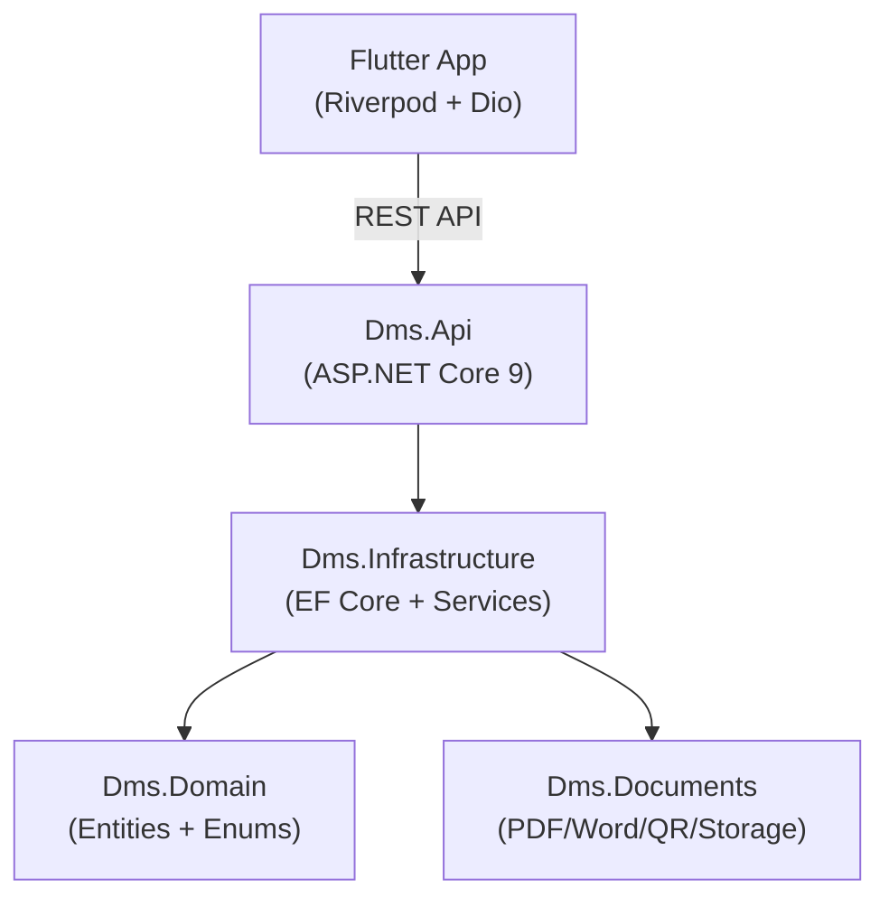
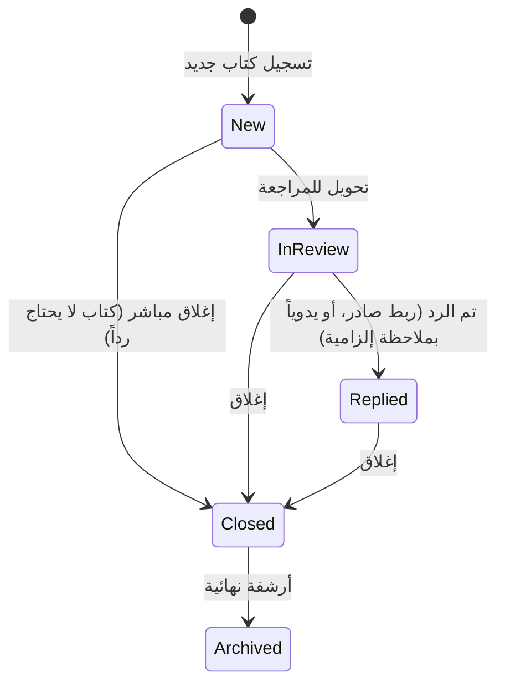

# خطة تنفيذ وحدة الكتب الواردة (Incoming Books Module)

> خطة تنفيذ شاملة ومفصلة لبناء وحدة "الوارد" في نظام إدارة الوثائق (DMS).
> تغطي جميع طبقات المشروع: Domain → Infrastructure → API → Flutter Frontend.
> **تم التحديث بناءً على قرارات المستخدم النهائية.**

---

## جدول المحتويات

1. [نظرة عامة على المشروع الحالي](#1-نظرة-عامة-على-المشروع-الحالي)
2. [طبقة Domain — الكيانات والأنواع الجديدة](#2-طبقة-domain)
3. [طبقة Infrastructure — قاعدة البيانات والخدمات](#3-طبقة-infrastructure)
4. [طبقة API — الـ Controllers والعقود](#4-طبقة-api)
5. [طبقة Flutter — النماذج والشاشات](#5-طبقة-flutter)
6. [الربط مع قسم الصادر](#6-الربط-مع-قسم-الصادر)
7. [سجل الحركة (Movement Log)](#7-سجل-الحركة)
8. [البحث المتقدم](#8-البحث-المتقدم)
9. [المرفقات](#9-المرفقات)
10. [لوحة التحكم (Dashboard)](#10-لوحة-التحكم)
11. [التقارير](#11-التقارير)
12. [خطة التحقق والاختبار](#12-خطة-التحقق-والاختبار)

---

## 1. نظرة عامة على المشروع الحالي

### البنية المعمارية القائمة



### الوحدات الموجودة حالياً

| الوحدة | Backend | Frontend | الحالة |
|--------|---------|----------|--------|
| الصادر (Outgoing) | ✅ كامل | ✅ كامل | مكتمل |
| الأرشيف (Archive) | ✅ كامل | ✅ كامل | مكتمل |
| المستخدمون (Users) | ✅ كامل | ✅ كامل | مكتمل |
| التقارير (Reports) | ✅ كامل | ✅ كامل | مكتمل |
| الإعدادات (Settings) | ✅ كامل | ✅ كامل | مكتمل |
| النسخ الاحتياطي (Backup) | ✅ كامل | ✅ كامل | مكتمل |
| **الوارد (Incoming)** | ❌ غير موجود | ❌ غير موجود | **هدف هذه الخطة** |

### القرار المعتمد بخصوص الأرشفة

> [!IMPORTANT]
> تم الاتفاق على أن الكتاب الوارد عندما يصل إلى مرحلة "الأرشفة النهائية" سيبقى في جدوله (`IncomingBooks`) مع تغيير حالته إلى `Archived`، ولن يُنقل إلى جدول الأرشيف (`ArchiveDocs`). جدول الأرشيف الحالي يظل مخصصاً للأضابير القديمة والملفات التاريخية فقط.

---

## 2. طبقة Domain

### 2.1 كيان الكتاب الوارد الجديد

#### [NEW] [IncomingBook.cs](file:///d:/DMS/backend/Dms.Domain/IncomingBook.cs)

كيان جديد يمثل الكتاب الوارد. مصمم بنفس الأنماط المستخدمة في [OutgoingBook.cs](file:///d:/DMS/backend/Dms.Domain/OutgoingBook.cs) مع حقول إضافية خاصة بطبيعة الوارد.

| الحقل | النوع | الوصف | ملاحظات |
|-------|-------|-------|---------|
| `IncomingId` | `int` (PK, Identity) | المفتاح الأساسي | يتولد تلقائياً |
| `CompanyId` | `int` | معرف الشركة | للعزل متعدد المستأجرين |
| `IncomingNumber` | `string?` | رقم الوارد الداخلي | يتولد تلقائياً عند التسجيل، مثل `DEN-IN-2026-00015` |
| `Year` | `int?` | سنة التسجيل | يُملأ عند التسجيل |
| `SerialNo` | `int?` | الرقم التسلسلي | ضمن (الشركة + السنة) |
| `ExternalNumber` | `string?` | رقم الكتاب الخارجي | الرقم الوارد من الجهة المرسلة |
| `ExternalDate` | `DateTime?` | تاريخ الكتاب الخارجي | تاريخ إصدار الكتاب من الجهة |
| `ReceivedDate` | `DateTime` | تاريخ الاستلام | تاريخ وصول الكتاب للمؤسسة |
| `ReceivedTime` | `TimeSpan?` | وقت الاستلام | الوقت الدقيق للاستلام |
| `EntityId` | `int` | الجهة المرسلة (FK → Entities) | الجهة التي أرسلت الكتاب |
| `Subject` | `string` | موضوع الكتاب | عنوان/موضوع الكتاب الوارد |
| `DocumentTypeId` | `int?` | نوع الكتاب (FK → DocumentTypes) | تصنيف نوع الكتاب |
| `ReceiveMethod` | `ReceiveMethod` | طريقة الاستلام | يدوي / بريد / بريد إلكتروني |
| `ReceivedByUserId` | `int` | الموظف المستلم | من استلم الكتاب فعلياً |
| `Status` | `IncomingStatus` | حالة الكتاب | جديد → قيد المراجعة → تم الرد → مغلق → مؤرشف |
| `FolderName` | `string?` | اسم المجلد/القسم | نص حر — اسم المجلد أو القسم المحول إليه (لا يوجد جدول مجلدات؛ **تقرر حذف حقل `FolderId` نهائياً** والاكتفاء بالاسم النصي) |
| `LastAction` | `string?` | آخر إجراء | وصف نصي لآخر إجراء تم |
| `Keywords` | `string?` | كلمات مفتاحية | للبحث، مفصولة بفاصلة |
| `Notes` | `string?` | ملاحظات | ملاحظات إضافية |
| `Amount` | `decimal?` | المبلغ | القيمة المالية إن وجدت |
| `Currency` | `Currency?` | العملة | دينار عراقي / دولار |
| `ExchangeRate` | `decimal?` | سعر الصرف | عند استخدام عملة غير الدينار |
| `AmountInIqd` | `decimal?` | المبلغ بالدينار | مُحسوب تلقائياً |
| `ReplyOutgoingId` | `int?` | رقم الصادر المرتبط | **ربط مع الصادر**: إذا تم الرد عليه بكتاب صادر |
| `CreatedByUserId` | `int` | المنشئ | من أدخل الكتاب في النظام |
| `CreatedAt` | `DateTime` | تاريخ الإنشاء | توقيت الإدخال |
| `UpdatedAt` | `DateTime?` | تاريخ آخر تعديل | |
| `IsDeleted` | `bool` | حذف ناعم | |
| `DeletedByUserId` | `int?` | من حذف | |
| `DeletedAt` | `DateTime?` | تاريخ الحذف | |
| Navigation: `Entity?` | | الجهة المرسلة | علاقة FK |
| Navigation: `ReplyOutgoing?` | `OutgoingBook?` | الصادر المرتبط | علاقة اختيارية |

---

### 2.2 الأنواع الجديدة (Enums)

#### [MODIFY] [Enums.cs](file:///d:/DMS/backend/Dms.Domain/Enums.cs)

**إضافة `IncomingStatus` enum — حالات الكتاب الوارد:**

```csharp
/// <summary>حالة الكتاب الوارد.</summary>
public enum IncomingStatus
{
    New        = 0,   // جديد — تم الاستلام لكن لم يُراجع بعد
    InReview   = 1,   // قيد المراجعة — قيد الدراسة من القسم المختص
    Replied    = 2,   // تم الرد — تم إصدار كتاب صادر كرد
    Closed     = 3,   // مغلق — لا يحتاج إجراء إضافي
    Archived   = 4,   // مؤرشف — أرشفة نهائية
}
```

**إضافة `ReceiveMethod` enum — طريقة الاستلام:**

```csharp
/// <summary>طريقة استلام الكتاب الوارد.</summary>
public enum ReceiveMethod
{
    Manual = 0,   // يدوي — تسليم باليد
    Mail   = 1,   // بريد — بريد عادي
    Email  = 2,   // بريد إلكتروني
}
```

**تحديث `OwnerType` enum — إضافة Incoming:**

```diff
 public enum OwnerType
 {
     Outgoing = 0,
     Archive = 1,
+    Incoming = 2,
 }
```

> [!WARNING]
> إضافة `Incoming = 2` إلى `OwnerType` ضرورية لأن المرفقات (`Attachment`) وسجل الإصدارات (`DocumentVersion`) يستخدمان هذا النوع كـ discriminator. بدون هذه الإضافة لن نتمكن من ربط المرفقات بالكتاب الوارد.

**تحديث `AppModule` flags — إضافة وحدة الوارد:**

```diff
 [Flags]
 public enum AppModule
 {
     None     = 0,
     Outgoing = 1,
     Archive  = 2,
     Reports  = 4,
     Users    = 8,
     Settings = 16,
     Backup   = 32,
+    Incoming = 64,
-    All = Outgoing | Archive | Reports | Users | Settings | Backup, // 63
+    All = Outgoing | Archive | Reports | Users | Settings | Backup | Incoming, // 127
 }
```

وتحديث مصفوفة `Individual` في `AppModuleExtensions`:

```diff
 private static readonly AppModule[] Individual =
-    { AppModule.Outgoing, AppModule.Archive, AppModule.Reports, AppModule.Users, AppModule.Settings, AppModule.Backup };
+    { AppModule.Outgoing, AppModule.Archive, AppModule.Reports, AppModule.Users, AppModule.Settings, AppModule.Backup, AppModule.Incoming };
```

> [!IMPORTANT]
> تحديث `All` من `63` إلى `127` يعني أن المستخدمين الحاليين الذين لديهم `Modules = 63` (All القديم) لن يحصلوا تلقائياً على صلاحية الوارد. يجب كتابة **migration seed** يحدّث `Modules = Modules | 64` لكل مستخدم لديه القيمة القديمة الكاملة (63).
>
> **توضيحان مهمان:**
> 1. السوبر أدمن ورئيس الشركة **معفيان أصلاً في الكود** (`HttpCurrentUser.AllowedModules` يرجع `AppModule.All` لهما مباشرة) — فهما سيحصلان على الوارد تلقائياً بدون seed. الـ seed يفيد **المدراء والموظفين** الذين مُنحوا كل الأقسام (63).
> 2. قيمة `Modules` مضمّنة داخل الـ **JWT**، لذا المستخدمون المسجلون دخولاً وقت النشر يحتاجون **إعادة تسجيل دخول** (أو انتظار تجديد التوكن) ليظهر لهم قسم الوارد.

---

### 2.3 كيان سجل الحركة

#### [NEW] [MovementLog.cs](file:///d:/DMS/backend/Dms.Domain/MovementLog.cs)

سجل حركة مخصص للكتب الواردة يتتبع كل عملية تتم على الكتاب بتفصيل أكبر من `AuditLog` العام. هذا السجل مرئي في شاشة تفاصيل الكتاب الوارد (للسوبر أدمن ورئيس الشركة فقط حسب الخطة).

| الحقل | النوع | الوصف |
|-------|-------|-------|
| `MovementId` | `int` (PK, Identity) | المفتاح الأساسي |
| `IncomingId` | `int` (FK → IncomingBooks) | الكتاب الوارد المرتبط |
| `CompanyId` | `int` | معرف الشركة |
| `Action` | `string` | نوع الإجراء (Received, Scanned, Registered, Forwarded, Reviewed, Replied, Closed, Archived) |
| `Description` | `string` | وصف الإجراء بالعربية (مثل: "استلم الموظف أحمد الكتاب") |
| `FromDepartment` | `string?` | القسم المحوِّل |
| `ToDepartment` | `string?` | القسم المحوَّل إليه |
| `PerformedByUserId` | `int` | المستخدم الذي نفذ الإجراء |
| `PerformedAt` | `DateTime` | تاريخ ووقت الإجراء |

> [!NOTE]
> سجل الحركة (`MovementLog`) مختلف عن `AuditLog` الموجود. الـ `AuditLog` يسجل عمليات CRUD عامة لكل الوحدات، بينما `MovementLog` مصمم خصيصاً لتتبع دورة حياة الكتاب الوارد بتفاصيل تشغيلية (تحويل بين أقسام، استلام، مسح ضوئي... إلخ). سنستمر باستخدام `AuditLog` أيضاً بالتوازي لتسجيل العمليات العامة (Create/Update/Delete) كما هو الحال في الصادر والأرشيف.

---

### 2.4 تحديث كيان الصادر (للربط)

#### [MODIFY] [OutgoingBook.cs](file:///d:/DMS/backend/Dms.Domain/OutgoingBook.cs)

إضافة حقل اختياري لربط الصادر بالوارد الذي يرد عليه:

```diff
  public DateTime? DeletedAt { get; set; }

+ /// <summary>إذا كان هذا الصادر ردّاً على كتاب وارد.</summary>
+ public int? ReplyToIncomingId { get; set; }

  /// <summary>للتزامن المتفائل عند التعديل بعد الاعتماد.</summary>
  public byte[]? RowVersion { get; set; }

  public Entity? Entity { get; set; }
  public Template? Template { get; set; }
+ public IncomingBook? ReplyToIncoming { get; set; }
```

> [!NOTE]
> العلاقة ثنائية الاتجاه:
> - من الوارد: `IncomingBook.ReplyOutgoingId` → يشير للصادر الذي رد عليه
> - من الصادر: `OutgoingBook.ReplyToIncomingId` → يشير للوارد الذي هو رد عليه
> - عند ربطهما، يتم تحديث الحقلين معاً في عملية واحدة

---

## 3. طبقة Infrastructure

### 3.1 تحديث قاعدة البيانات (AppDbContext)

#### [MODIFY] [AppDbContext.cs](file:///d:/DMS/backend/Dms.Infrastructure/Persistence/AppDbContext.cs)

**إضافة DbSets جديدة:**

```csharp
public DbSet<IncomingBook> IncomingBooks => Set<IncomingBook>();
public DbSet<MovementLog> MovementLogs => Set<MovementLog>();
```

**إضافة Query Filters (عزل الشركة + حذف ناعم):**

```csharp
// IncomingBook — نفس نمط OutgoingBook
modelBuilder.Entity<IncomingBook>(e =>
{
    e.HasKey(x => x.IncomingId);
    e.HasQueryFilter(x =>
        (!_filterByCompany || x.CompanyId == _companyId) && !x.IsDeleted);

    // الترقيم الفريد ضمن الشركة
    e.Property(x => x.IncomingNumber).HasMaxLength(40);
    e.HasIndex(x => x.IncomingNumber).IsUnique()
        .HasFilter("[IncomingNumber] IS NOT NULL");
    e.HasIndex(x => new { x.CompanyId, x.Year, x.SerialNo }).IsUnique()
        .HasFilter("[Year] IS NOT NULL AND [SerialNo] IS NOT NULL");

    // الحقول النصية
    e.Property(x => x.Subject).IsRequired().HasMaxLength(500);
    e.Property(x => x.ExternalNumber).HasMaxLength(100);
    e.Property(x => x.Keywords).HasMaxLength(1000);
    e.Property(x => x.FolderName).HasMaxLength(200);
    e.Property(x => x.LastAction).HasMaxLength(500);

    // الحقول المالية
    e.Property(x => x.Amount).HasColumnType("decimal(18,2)");
    e.Property(x => x.ExchangeRate).HasColumnType("decimal(18,4)");
    e.Property(x => x.AmountInIqd).HasColumnType("decimal(18,2)");

    // العلاقات
    e.HasOne(x => x.Entity)
        .WithMany()
        .HasForeignKey(x => x.EntityId)
        .OnDelete(DeleteBehavior.Restrict);

    e.HasOne(x => x.ReplyOutgoing)
        .WithMany()
        .HasForeignKey(x => x.ReplyOutgoingId)
        .OnDelete(DeleteBehavior.SetNull);

    // فهرس للبحث السريع
    e.HasIndex(x => x.EntityId);
    e.HasIndex(x => x.Status);
    e.HasIndex(x => x.ReceivedDate);
});

// MovementLog
modelBuilder.Entity<MovementLog>(e =>
{
    e.HasKey(x => x.MovementId);
    e.HasQueryFilter(x => !_filterByCompany || x.CompanyId == _companyId);

    e.Property(x => x.Action).IsRequired().HasMaxLength(50);
    e.Property(x => x.Description).IsRequired().HasMaxLength(500);
    e.Property(x => x.FromDepartment).HasMaxLength(200);
    e.Property(x => x.ToDepartment).HasMaxLength(200);

    e.HasIndex(x => x.IncomingId);
    e.HasIndex(x => x.PerformedAt);
});
```

**تحديث علاقة OutgoingBook (إضافة ربط الوارد):**

```csharp
// في الإعدادات الموجودة لـ OutgoingBook — إضافة:
e.HasOne(x => x.ReplyToIncoming)
    .WithMany()
    .HasForeignKey(x => x.ReplyToIncomingId)
    .OnDelete(DeleteBehavior.SetNull);
```

---

### 3.2 ملف الهجرة (Migration)

#### [NEW] Migration: `AddIncomingModule`

سيتم إنشاؤه بالأمر:
```bash
dotnet ef migrations add AddIncomingModule -p Dms.Infrastructure -s Dms.Api
```

**ما سينشئه هذا الـ Migration:**

1. **جدول `IncomingBooks`** — بكل الأعمدة المذكورة أعلاه
2. **جدول `MovementLogs`** — لسجل الحركة
3. **عمود `ReplyToIncomingId`** على جدول `OutgoingBooks` — للربط مع الوارد
4. **عمود `ReplyOutgoingId`** على جدول `IncomingBooks` — للربط مع الصادر
5. **الفهارس** — كل الفهارس المحددة أعلاه
6. **تحديث بيانات المستخدمين** — Data migration لتحديث `Modules` bitmask:

```csharp
// في Up() method — تحديث المستخدمين الذين لديهم صلاحية All القديمة (63)
// ليشمل وحدة Incoming الجديدة (64) فيصبح المجموع 127
migrationBuilder.Sql(
    "UPDATE Users SET Modules = Modules | 64 WHERE (Modules & 63) = 63");
```

> [!CAUTION]
> يجب اختبار هذا الـ SQL على بيئة تجريبية أولاً. المنطق: كل مستخدم كانت لديه جميع الصلاحيات القديمة (63 = all six modules) سيحصل تلقائياً على صلاحية الوارد (64). المستخدمون الذين لديهم صلاحيات جزئية لن يتأثروا.

---

### 3.3 خدمة الوارد (IncomingService)

#### [NEW] [IIncomingService.cs + IncomingService.cs](file:///d:/DMS/backend/Dms.Infrastructure/Incoming/)

مجلد جديد `Dms.Infrastructure/Incoming/` يحتوي على ملف واحد (الواجهة والتنفيذ في نفس الملف، نفس نمط [OutgoingService.cs](file:///d:/DMS/backend/Dms.Infrastructure/Outgoing/OutgoingService.cs)).

**الواجهة `IIncomingService`:**

```csharp
public interface IIncomingService
{
    IQueryable<IncomingBook> Query();
    Task<IncomingBook> GetAsync(int id, CancellationToken ct);
    Task<IncomingBook> CreateAsync(CreateIncomingInput input, CancellationToken ct);
    Task UpdateAsync(int id, UpdateIncomingInput input, CancellationToken ct);
    Task ChangeStatusAsync(int id, IncomingStatus newStatus, string? note, CancellationToken ct);
    Task ForwardAsync(int id, string toDepartment, string? note, CancellationToken ct);
    Task LinkToOutgoingAsync(int incomingId, int outgoingId, CancellationToken ct);
    Task UnlinkFromOutgoingAsync(int incomingId, CancellationToken ct);
    Task SoftDeleteAsync(int id, CancellationToken ct);
    Task<List<MovementLog>> GetMovementLogAsync(int id, CancellationToken ct);
}
```

**التنفيذ `IncomingService` — التفاصيل:**

##### `Query()` — الاستعلام مع التحكم بالرؤية

```
- نفس نمط OutgoingService.Query()
- Employee/Reader: يرى فقط الكتب التي استلمها (ReceivedByUserId == currentUser)
- Manager+: يرى كل كتب الشركة
- يشمل: .Include(x => x.Entity)
```

##### `GetAsync(id)` — جلب كتاب واحد

```
- يجلب الكتاب مع Entity + ReplyOutgoing
- يرمي NotFoundException إذا لم يجد
- يتحقق من صلاحية المستخدم للرؤية
```

##### `CreateAsync(input)` — إنشاء كتاب وارد جديد

```
خطوات التنفيذ:
1. التحقق من الصلاحيات: Employee+ يستطيع الإنشاء
2. التحقق من EntityId موجود ونوعه Incoming أو Both
3. حساب المبلغ بالدينار (FinancialCalculator.ComputeIqd) إذا وجد مبلغ
4. إنشاء كيان IncomingBook مع:
   - Status = IncomingStatus.New
   - ReceivedDate = التاريخ المحدد أو DateTime.UtcNow
   - ReceivedByUserId = CurrentUser.UserId
   - CreatedByUserId = CurrentUser.UserId
   - CreatedAt = DateTime.UtcNow
5. توليد رقم الوارد الداخلي عبر NumberingService:
   - نوع Counter جديد: "Incoming"
   - الصيغة: {Prefix}-IN-{Year}-{Serial:D5}
   - مثال: DEN-IN-2026-00015
   - يتم داخل ExecutionStrategy للحماية من التكرار
6. تسجيل حركة: Action="Registered", Description="تم تسجيل الكتاب الوارد"
7. تسجيل AuditLog: Action="Create", EntityType="IncomingBook"
8. SaveChanges
9. إرجاع الكتاب المنشأ
```

##### `UpdateAsync(id, input)` — تحديث بيانات الكتاب

```
خطوات التنفيذ:
1. جلب الكتاب
2. التحقق: لا يمكن تعديل كتاب بحالة Archived
3. التحقق من الصلاحيات:
   - صاحب الكتاب (CreatedByUserId) يعدل إذا Status == New
   - Manager+ يعدل في أي حالة عدا Archived
4. تحديث الحقول المتغيرة
5. إعادة حساب AmountInIqd إذا تغيرت القيم المالية
6. تسجيل حركة: Action="Updated", Description="تم تحديث بيانات الكتاب"
7. تسجيل AuditLog
8. SaveChanges
```

##### `ChangeStatusAsync(id, newStatus, note)` — تغيير حالة الكتاب

```
خطوات التنفيذ:
1. جلب الكتاب
2. التحقق من صحة الانتقال بين الحالات:
   - New → InReview ✅
   - New → Closed ✅ (إغلاق مباشر لكتب لا تحتاج إجراء)
   - InReview → Replied ✅ (يدوياً: تتطلب **ملاحظة إلزامية** — انظر أدناه)
   - InReview → Closed ✅
   - Replied → Closed ✅
   - Closed → Archived ✅
   - أي انتقال آخر → ValidationException ❌
3. قاعدة «تم الرد» اليدوية (قرار معتمد):
   - الانتقال لـ Replied يتم تلقائياً عند الربط بصادر (LinkToOutgoingAsync)
   - ويُسمح به يدوياً أيضاً بدون ربط (للردود الورقية خارج النظام)،
     لكن عندها الحقل note **إلزامي** — بدونه ValidationException
   - الكتب التي لا تحتاج رداً أصلاً تسلك مسار: New → Closed → Archived
4. التحقق من الصلاحيات:
   - Employee: يستطيع New → InReview فقط
   - Manager+: يستطيع أي انتقال مسموح
   - أرشفة (→ Archived): Manager+ فقط
5. تحديث Status + LastAction
6. تسجيل حركة بوصف مناسب:
   - InReview: "تم تحويل الكتاب للمراجعة"
   - Replied: "تم الرد على الكتاب" (+ الملاحظة الإلزامية عند الرد اليدوي)
   - Closed: "تم إغلاق الكتاب"
   - Archived: "تم أرشفة الكتاب"
7. تسجيل AuditLog
8. SaveChanges
```

**مصفوفة انتقالات الحالة:**



##### `ForwardAsync(id, toDepartment, note)` — تحويل الكتاب لقسم

```
خطوات التنفيذ:
1. جلب الكتاب
2. التحقق: الحالة يجب أن تكون New أو InReview
3. حفظ القسم السابق في FromDepartment
4. تحديث FolderName = toDepartment
5. تغيير Status إلى InReview (إذا كان New)
6. تسجيل حركة: Action="Forwarded", FromDepartment, ToDepartment
7. تسجيل AuditLog
8. SaveChanges
```

##### `LinkToOutgoingAsync(incomingId, outgoingId)` — ربط بكتاب صادر

```
خطوات التنفيذ:
1. جلب الكتاب الوارد
2. التحقق: الصادر موجود ومعتمد (Status == Final) وفي نفس الشركة
3. التحقق: الوارد ليس مؤرشفاً
4. تحديث IncomingBook.ReplyOutgoingId = outgoingId
5. تحديث OutgoingBook.ReplyToIncomingId = incomingId
6. تغيير Status إلى Replied (إذا كان InReview)
7. تسجيل حركة: Action="Linked", Description="تم ربط الكتاب بالصادر رقم {number}"
8. تسجيل AuditLog لكلا الكتابين
9. SaveChanges
```

##### `UnlinkFromOutgoingAsync(incomingId)` — فك الربط

```
خطوات التنفيذ:
1. جلب الكتاب الوارد مع ReplyOutgoing
2. التحقق: يوجد ربط فعلاً
3. حفظ outgoingId القديم
4. تحديث IncomingBook.ReplyOutgoingId = null
5. تحديث OutgoingBook.ReplyToIncomingId = null (للصادر القديم)
6. إعادة Status إلى InReview (إذا كان Replied)
7. تسجيل حركة وAuditLog
8. SaveChanges
```

##### `SoftDeleteAsync(id)` — حذف ناعم

```
- نفس نمط OutgoingService.SoftDeleteAsync
- صاحب الكتاب (CreatedByUserId) يحذف فقط إذا Status == New
- Manager+ للكتب بحالة New / InReview / Replied / Closed
- الكتب بحالة Archived: SuperAdmin فقط (قرار معتمد — الرقم رسمي منذ الإنشاء)
- فك الربط مع الصادر إذا وجد
- تسجيل حركة وAuditLog
```

##### `GetMovementLogAsync(id)` — سجل الحركة

```
- جلب كل حركات الكتاب مرتبة بالتاريخ
- التحقق من الصلاحية (قرار معتمد — المرحلة الأولى):
  السجل مرئي لـ SuperAdmin و President فقط. غير ذلك → ForbiddenException.
- «الصلاحية المخصصة للمدراء» مؤجلة لمرحلة لاحقة (تتطلب عموداً جديداً على User
  على نمط CanApprove + claim + واجهة — انظر قسم القيود المؤجلة في نهاية الخطة).
```

---

### 3.4 Input DTOs (داخل الخدمة)

```csharp
public record CreateIncomingInput(
    string? ExternalNumber,
    DateTime? ExternalDate,
    DateTime ReceivedDate,
    TimeSpan? ReceivedTime,
    int EntityId,
    string Subject,
    int? DocumentTypeId,
    ReceiveMethod ReceiveMethod,
    string? FolderName,
    string? Keywords,
    string? Notes,
    decimal? Amount,
    int? Currency,       // 0=IQD, 1=USD
    decimal? ExchangeRate
);

public record UpdateIncomingInput(
    string? ExternalNumber,
    DateTime? ExternalDate,
    DateTime ReceivedDate,
    TimeSpan? ReceivedTime,
    int EntityId,
    string Subject,
    int? DocumentTypeId,
    ReceiveMethod ReceiveMethod,
    string? FolderName,
    string? Keywords,
    string? Notes,
    decimal? Amount,
    int? Currency,
    decimal? ExchangeRate
);
```

---

### 3.5 تحديث الترقيم (NumberingService)

#### [MODIFY] [NumberingService.cs](file:///d:/DMS/backend/Dms.Infrastructure/Services/NumberingService.cs)

لا يحتاج تعديل في الكود. الخدمة الحالية تعمل بنوع `string type` ("Outgoing" / "Archive"). سنمرر `"Incoming"` كنوع جديد عند استخدامها في `IncomingService`. جدول `Counters` (مفتاح مركب: CompanyId + Year + Type) سيُنشئ صف جديد تلقائياً لنوع "Incoming".

---

### 3.6 تحديث خدمة المرفقات

#### [MODIFY] [AttachmentService.cs](file:///d:/DMS/backend/Dms.Infrastructure/Attachments/AttachmentService.cs)

تحديث دالة التحقق من الصلاحيات `EnsureAccessAsync` لدعم `OwnerType.Incoming`:

```diff
  var requiredModule = type == OwnerType.Outgoing ? AppModule.Outgoing : AppModule.Archive;
+ // تحديث:
+ var requiredModule = type switch
+ {
+     OwnerType.Outgoing => AppModule.Outgoing,
+     OwnerType.Archive  => AppModule.Archive,
+     OwnerType.Incoming => AppModule.Incoming,
+     _ => throw new ValidationException("نوع غير معروف")
+ };
```

وتحديث دالة التحقق من الوصول للكيان المالك:

```diff
  OwnerType.Outgoing => await db.OutgoingBooks.Where(b => b.OutgoingId == ownerId)...
+ OwnerType.Incoming => await db.IncomingBooks.Where(b => b.IncomingId == ownerId)
+     .Select(b => b.CreatedByUserId).FirstOrDefaultAsync(ct),
```

**تعديلات إضافية مثبّتة ضمن أعمال التنفيذ** (الكود الحالي: 25MB وست صيغ — هذه التغييرات **لم تُنفَّذ بعد** وهي جزء من هذه الخطة):

```diff
- private const long MaxBytes = 25 * 1024 * 1024; // 25MB
+ private const long MaxBytes = 50 * 1024 * 1024; // 50MB — قرار معتمد لاستيعاب المخططات وملفات الأوتوكاد

- private static readonly string[] Allowed = [".pdf", ".jpg", ".jpeg", ".png", ".docx", ".xlsx"];
+ private static readonly string[] Allowed = [".pdf", ".jpg", ".jpeg", ".png", ".docx", ".xlsx", ".zip", ".dwg"];
```

مع تحديث رسالتي الخطأ المرافقتين (الحد «50 ميغابايت» وقائمة الصيغ المسموحة).

---

### 3.7 تحديث خدمة التقارير

#### [MODIFY] [ReportService.cs](file:///d:/DMS/backend/Dms.Infrastructure/Reports/ReportService.cs)

إضافة بيانات الوارد للتقرير المالي:

```
- إضافة خيار source = "Incoming" إلى FinancialAsync
- عند source = "All": يجمع Outgoing + Archive + Incoming
- يستعلم عن IncomingBooks التي لديها AmountInIqd != null
```

---

### 3.8 تحديث خدمة حذف الشركة

#### [MODIFY] [CompaniesController.cs](file:///d:/DMS/backend/Dms.Api/Controllers/CompaniesController.cs)

**قرار معتمد: المنع لا الحذف.** الكتاب الوارد يأخذ رقماً رسمياً **عند الإنشاء مباشرة** (بخلاف الصادر الذي يترقّم عند الاعتماد)، فكل كتاب وارد يُعدّ سجلاً رسمياً — تماماً كالفحص الحالي `hasApproved`/`hasArchive`.

```diff
  var hasArchive = await db.ArchiveDocs.IgnoreQueryFilters()
      .AnyAsync(a => a.CompanyId == id, ct);
+ var hasIncoming = await db.IncomingBooks.IgnoreQueryFilters()
+     .AnyAsync(b => b.CompanyId == id, ct);
- if (hasApproved || hasArchive)
-     throw new ConflictException("لا يمكن حذف شركة لها كتب صادرة معتمدة أو أرشيف. عطّل الشركة بدل حذفها.");
+ if (hasApproved || hasArchive || hasIncoming)
+     throw new ConflictException("لا يمكن حذف شركة لها كتب صادرة معتمدة أو أرشيف أو كتب واردة. عطّل الشركة بدل حذفها.");
```

> [!NOTE]
> بما أن الحذف ممنوع عند وجود أي كتاب وارد، **لا حاجة** لإضافة منطق حذف `IncomingBooks`/`MovementLogs`/مرفقات `OwnerType.Incoming` داخل معاملة حذف الشركة — الشركة التي تُحذف لا تملك أي كتب واردة بالتعريف.

---

### 3.9 تحديث تسجيل الحقن (DI)

#### [MODIFY] [DependencyInjection.cs](file:///d:/DMS/backend/Dms.Infrastructure/DependencyInjection.cs)

```diff
+ using Dms.Infrastructure.Incoming;

  // في AddInfrastructure:
+ services.AddScoped<IIncomingService, IncomingService>();
```

---

## 4. طبقة API

### 4.1 وحدة التحكم بالوارد

#### [NEW] [IncomingController.cs](file:///d:/DMS/backend/Dms.Api/Controllers/IncomingController.cs)

```
[ApiController]
[Route("api/incoming")]
[RequireModule(AppModule.Incoming)]
public sealed class IncomingController : ControllerBase
```

**الـ Endpoints:**

| HTTP | المسار | الوصف | المدخلات | المخرجات |
|------|--------|-------|----------|----------|
| GET | `/` | قائمة الكتب الواردة | `?status&search&entityId&from&to&documentTypeId&folderName&receiveMethod` | `List<IncomingListItem>` |
| GET | `/{id}` | تفاصيل كتاب وارد | `id` | `IncomingDetail` |
| POST | `/` | تسجيل كتاب وارد جديد | `CreateIncomingRequest` (body) | `IncomingDetail` |
| PUT | `/{id}` | تعديل كتاب وارد | `UpdateIncomingRequest` (body) | `IncomingDetail` |
| POST | `/{id}/status` | تغيير حالة الكتاب | `ChangeStatusRequest` (body) | `IncomingDetail` |
| POST | `/{id}/forward` | تحويل لقسم | `ForwardRequest` (body) | `IncomingDetail` |
| POST | `/{id}/link/{outgoingId}` | ربط بكتاب صادر | `outgoingId` | `IncomingDetail` |
| DELETE | `/{id}/link` | فك ربط الصادر | — | `IncomingDetail` |
| DELETE | `/{id}` | حذف ناعم | `id` | `NoContent` |
| GET | `/{id}/movements` | سجل الحركة | `id` | `List<MovementLogItem>` |
| GET | `/{id}/attachments` | قائمة المرفقات | `id` | `List<AttachmentResponse>` |
| POST | `/{id}/attachments` | رفع مرفق | `IFormFile` | `AttachmentResponse` |

---

### 4.2 العقود (DTOs)

#### [MODIFY] [Contracts.cs](file:///d:/DMS/backend/Dms.Api/Dtos/Contracts.cs)

**إضافة DTOs جديدة:**

```csharp
// ----------------- Incoming -----------------

public sealed record CreateIncomingRequest(
    string? ExternalNumber,
    DateTime? ExternalDate,
    DateTime ReceivedDate,
    TimeSpan? ReceivedTime,
    int EntityId,
    string Subject,
    int? DocumentTypeId,
    int ReceiveMethod,        // 0=Manual, 1=Mail, 2=Email
    string? FolderName,
    string? Keywords,
    string? Notes,
    decimal? Amount,
    int? Currency,
    decimal? ExchangeRate
);

public sealed record UpdateIncomingRequest(
    string? ExternalNumber,
    DateTime? ExternalDate,
    DateTime ReceivedDate,
    TimeSpan? ReceivedTime,
    int EntityId,
    string Subject,
    int? DocumentTypeId,
    int ReceiveMethod,
    string? FolderName,
    string? Keywords,
    string? Notes,
    decimal? Amount,
    int? Currency,
    decimal? ExchangeRate
);

public sealed record ChangeStatusRequest(
    int Status,               // 0=New, 1=InReview, 2=Replied, 3=Closed, 4=Archived
    string? Note
);

public sealed record ForwardRequest(
    string ToDepartment,
    string? Note
);

public sealed record IncomingListItem(
    int IncomingId,
    string? IncomingNumber,
    string? ExternalNumber,
    DateTime ReceivedDate,
    string Subject,
    string EntityName,
    string Status,            // "New"/"InReview"/"Replied"/"Closed"/"Archived"
    string? FolderName,
    decimal? AmountInIqd
);

public sealed record IncomingDetail(
    int IncomingId,
    int CompanyId,
    string? IncomingNumber,
    int? Year,
    int? SerialNo,
    string? ExternalNumber,
    DateTime? ExternalDate,
    DateTime ReceivedDate,
    TimeSpan? ReceivedTime,
    int EntityId,
    string EntityName,
    string Subject,
    int? DocumentTypeId,
    string? DocumentTypeName,
    int ReceiveMethod,
    int ReceivedByUserId,
    string ReceivedByUserName,
    string Status,
    string? FolderName,
    string? LastAction,
    string? Keywords,
    string? Notes,
    decimal? Amount,
    int? Currency,
    decimal? ExchangeRate,
    decimal? AmountInIqd,
    int? ReplyOutgoingId,
    string? ReplyOutgoingNumber,   // رقم الصادر المرتبط (للعرض)
    DateTime CreatedAt
);

public sealed record MovementLogItem(
    int MovementId,
    string Action,
    string Description,
    string? FromDepartment,
    string? ToDepartment,
    string PerformedByUserName,
    DateTime PerformedAt
);
```

---

## 5. طبقة Flutter

### 5.1 النماذج (Models)

#### [MODIFY] [models.dart](file:///d:/DMS/app/lib/models.dart)

**إضافة نماذج الوارد:**

```dart
// ──────────────────── Incoming ────────────────────

class IncomingListItem {
  final int incomingId;
  final String? incomingNumber;
  final String? externalNumber;
  final DateTime receivedDate;
  final String subject;
  final String entityName;
  final String status;
  final String? folderName;
  final double? amountInIqd;

  IncomingListItem(this.incomingId, this.incomingNumber, this.externalNumber,
      this.receivedDate, this.subject, this.entityName, this.status,
      this.folderName, this.amountInIqd);

  factory IncomingListItem.fromJson(Map<String, dynamic> j) => IncomingListItem(
      j['incomingId'], j['incomingNumber'], j['externalNumber'],
      DateTime.parse(j['receivedDate']), j['subject'], j['entityName'],
      j['status'], j['folderName'],
      (j['amountInIqd'] as num?)?.toDouble());
}

class IncomingDetail {
  final int incomingId;
  final int companyId;
  final String? incomingNumber;
  final int? year;
  final int? serialNo;
  final String? externalNumber;
  final DateTime? externalDate;
  final DateTime receivedDate;
  final String? receivedTime;       // "HH:mm:ss"
  final int entityId;
  final String entityName;
  final String subject;
  final int? documentTypeId;
  final String? documentTypeName;
  final int receiveMethod;          // 0=Manual, 1=Mail, 2=Email
  final int receivedByUserId;
  final String receivedByUserName;
  final String status;
  final String? folderName;
  final String? lastAction;
  final String? keywords;
  final String? notes;
  final double? amount;
  final int? currency;
  final double? exchangeRate;
  final double? amountInIqd;
  final int? replyOutgoingId;
  final String? replyOutgoingNumber;
  final DateTime createdAt;

  IncomingDetail({required all fields...});

  factory IncomingDetail.fromJson(Map<String, dynamic> j) => ...;
}

class MovementLogItem {
  final int movementId;
  final String action;
  final String description;
  final String? fromDepartment;
  final String? toDepartment;
  final String performedByUserName;
  final DateTime performedAt;

  MovementLogItem(...);
  factory MovementLogItem.fromJson(Map<String, dynamic> j) => ...;
}
```

---

### 5.2 عميل الـ API

#### [MODIFY] [api_client.dart](file:///d:/DMS/app/lib/core/api_client.dart)

**إضافة methods جديدة للوارد:**

```dart
// ──────────────────── Incoming ────────────────────

Future<List<IncomingListItem>> incomingList({
    String? status, String? search, int? entityId,
    String? from, String? to, int? documentTypeId, String? folderName,
    int? receiveMethod,
}) async {
  final q = <String, dynamic>{};
  if (status != null) q['status'] = status;
  if (search != null) q['search'] = search;
  if (entityId != null) q['entityId'] = entityId;
  if (from != null) q['from'] = from;
  if (to != null) q['to'] = to;
  if (documentTypeId != null) q['documentTypeId'] = documentTypeId;
  if (folderName != null) q['folderName'] = folderName;
  if (receiveMethod != null) q['receiveMethod'] = receiveMethod;
  return (await _get('/incoming', query: q) as List)
      .map((e) => IncomingListItem.fromJson(e)).toList();
}

Future<IncomingDetail> incomingGet(int id) async =>
    IncomingDetail.fromJson(await _get('/incoming/$id'));

Future<IncomingDetail> createIncoming(Map<String, dynamic> body) async =>
    IncomingDetail.fromJson(await _post('/incoming', body));

Future<IncomingDetail> updateIncoming(int id, Map<String, dynamic> body) async =>
    IncomingDetail.fromJson(await _put('/incoming/$id', body));

Future<IncomingDetail> changeIncomingStatus(int id, int status, String? note) async =>
    IncomingDetail.fromJson(await _post('/incoming/$id/status', {
      'status': status, 'note': note,
    }));

Future<IncomingDetail> forwardIncoming(int id, String toDepartment, String? note) async =>
    IncomingDetail.fromJson(await _post('/incoming/$id/forward', {
      'toDepartment': toDepartment, 'note': note,
    }));

Future<IncomingDetail> linkIncomingToOutgoing(int incomingId, int outgoingId) async =>
    IncomingDetail.fromJson(await _post('/incoming/$incomingId/link/$outgoingId', null));

Future<IncomingDetail> unlinkIncomingFromOutgoing(int incomingId) async =>
    IncomingDetail.fromJson(await _delete('/incoming/$incomingId/link'));

Future<void> deleteIncoming(int id) => _delete('/incoming/$id');

Future<List<MovementLogItem>> incomingMovements(int id) async =>
    (await _get('/incoming/$id/movements') as List)
        .map((e) => MovementLogItem.fromJson(e)).toList();

Future<List<AttachmentModel>> incomingAttachments(int id) async =>
    (await _get('/incoming/$id/attachments') as List)
        .map((e) => AttachmentModel.fromJson(e)).toList();

Future<AttachmentModel> uploadIncomingAttachment(int id, String filePath, String fileName) async {
  final form = FormData.fromMap({
    'file': await MultipartFile.fromFile(filePath, filename: fileName),
  });
  return AttachmentModel.fromJson(await _postForm('/incoming/$id/attachments', form));
}
```

---

### 5.3 مزودات البيانات (Providers)

#### [NEW] [incoming_providers.dart](file:///d:/DMS/app/lib/core/incoming_providers.dart)

```dart
// نفس نمط outgoing_providers.dart

final incomingListProvider = FutureProvider.autoDispose<List<IncomingListItem>>((ref) async {
  final auth = ref.watch(sessionProvider).auth;
  if (auth == null || !auth.hasModule('Incoming')) return <IncomingListItem>[];
  return ref.read(apiClientProvider).incomingList();
});

final newIncomingCountProvider = FutureProvider.autoDispose<int>((ref) async {
  final items = await ref.watch(incomingListProvider.future);
  return items.where((i) => i.status == 'New').length;
});

final incomingCountProvider = FutureProvider.autoDispose<int>((ref) async {
  final items = await ref.watch(incomingListProvider.future);
  return items.length;
});

void invalidateIncoming(WidgetRef ref) {
  ref.invalidate(incomingListProvider);
  ref.invalidate(newIncomingCountProvider);
  ref.invalidate(incomingCountProvider);
}
```

---

### 5.4 شاشة قائمة الوارد

#### [NEW] [incoming_list_screen.dart](file:///d:/DMS/app/lib/screens/incoming_list_screen.dart)

مصممة بنفس هيكل [outgoing_list_screen.dart](file:///d:/DMS/app/lib/screens/outgoing_list_screen.dart) مع التعديلات التالية:

**عناصر الواجهة:**

```
┌─────────────────────────────────────────────────────────┐
│  🔍 بحث...        [▾ الحالة]  [▾ الجهة]  [+ كتاب وارد] │
├─────────────────────────────────────────────────────────┤
│  رقم الوارد │ رقم خارجي │ تاريخ الاستلام │ الجهة │     │
│  الموضوع │ القسم/المجلد │ المبلغ (د.ع) │ الحالة │ ⚙️   │
├─────────────────────────────────────────────────────────┤
│  DEN-IN-2026-00015 │ 4125 │ 2026/07/18 │ وزارة... │    │
│  صيانة المحطة │ الصيانة │ - │ قيد المراجعة │ 👁️ ✏️ 🗑️ │
└─────────────────────────────────────────────────────────┘
```

**الأعمدة:**
1. رقم الوارد الداخلي + تاريخ الاستلام
2. رقم الكتاب الخارجي
3. الجهة المرسلة
4. الموضوع
5. القسم/المجلد
6. المبلغ (د.ع) — إذا وجد
7. الحالة (StatusPill بألوان مختلفة)
8. إجراءات (عرض، تعديل، حذف)

**فلاتر:**
- حقل بحث نصي (يبحث في الموضوع، رقم الوارد، رقم الكتاب الخارجي)
- قائمة منسدلة للحالة: الكل / جديد / قيد المراجعة / تم الرد / مغلق / مؤرشف
- (اختياري) قائمة منسدلة للجهة المرسلة

---

### 5.5 شاشة تفاصيل الوارد

#### [NEW] [incoming_detail_screen.dart](file:///d:/DMS/app/lib/screens/incoming_detail_screen.dart)

مصممة على نمط [archive_detail_screen.dart](file:///d:/DMS/app/lib/screens/archive_detail_screen.dart) مع تحسينات:

**التخطيط (Split Layout):**

```
┌──────────────────────────┬───────────────────────────┐
│     بيانات الكتاب        │     عارض المرفقات         │
│                          │                           │
│  ━━━ بيانات أساسية ━━━    │  ┌───────────────────┐   │
│  رقم الوارد: 2026/1548   │  │                   │   │
│  رقم الكتاب: 4125        │  │    PDF Viewer      │   │
│  التاريخ: 2026/07/18     │  │    (مدمج)          │   │
│  الجهة: وزارة الكهرباء   │  │                   │   │
│  الموضوع: صيانة المحطة   │  │  🔍+ 🔍- 🖨️ ⬇️   │   │
│  الموظف: أحمد            │  └───────────────────┘   │
│  طريقة الاستلام: يدوي     │                           │
│  القسم: الصيانة          │  ━━━ المرفقات ━━━         │
│  الحالة: ⚡ تم الرد       │  📄 الكتاب.pdf  ⬇️ 🗑️    │
│                          │  📄 جدول.xlsx   ⬇️ 🗑️    │
│  ━━━ مالي ━━━            │  📷 صورة.jpg    ⬇️ 🗑️    │
│  المبلغ: -               │  [+ رفع مرفق]            │
│                          │                           │
│  ━━━ الربط بالصادر ━━━    │                           │
│  🔗 تم الرد بالصادر 254  │                           │
│     [فتح الصادر]         │                           │
│                          │                           │
│  ━━━ إجراءات ━━━          │                           │
│  [تحويل لقسم] [تغيير     │                           │
│   الحالة] [ربط بصادر]    │                           │
│  [تعديل] [حذف]           │                           │
│                          │                           │
│  ━━━ سجل الحركة ━━━       │                           │
│  (صلاحيات محددة فقط)      │                           │
│  09:15 استلم أحمد الكتاب  │                           │
│  09:17 تم رفع PDF        │                           │
│  09:18 تم التسجيل        │                           │
│  09:22 حول للمالية        │                           │
│  09:40 استلمه المالية     │                           │
│  11:10 تم الرد           │                           │
│  11:30 تم الأرشفة        │                           │
└──────────────────────────┴───────────────────────────┘
```

**الأقسام بالتفصيل:**

1. **بيانات الكتاب الأساسية**: رقم الوارد، رقم الكتاب الخارجي، تاريخ الكتاب، تاريخ/وقت الاستلام، الجهة، الموضوع، نوع الكتاب، طريقة الاستلام، الموظف المستلم، القسم، الحالة

2. **بيانات مالية** (إذا وجدت): المبلغ، العملة، سعر الصرف، المبلغ بالدينار

3. **بيانات إضافية**: الكلمات المفتاحية، الملاحظات

4. **الربط بالصادر**: إذا تم ربطه بكتاب صادر، يظهر رقم الصادر مع زر للانتقال لشاشة تفاصيل الصادر. إذا لم يُربط، يظهر زر "ربط بكتاب صادر" يفتح نافذة لاختيار كتاب صادر

5. **أزرار الإجراءات**:
   - `تحويل لقسم` → dialog لإدخال اسم القسم
   - `تغيير الحالة` → dropdown بالحالات المتاحة
   - `ربط بصادر` / `فك الربط` → حسب الحالة الحالية
   - `تعديل` → ينتقل لشاشة التعديل
   - `حذف` → تأكيد ثم حذف

6. **سجل الحركة** (Timeline): يظهر للسوبر أدمن ورئيس الشركة **فقط** (المرحلة الأولى — صلاحية المدراء المخصصة مؤجلة). عرض زمني عمودي (Timeline) بكل الحركات مرتبة من الأقدم للأحدث مع الوقت والوصف واسم المستخدم

7. **عارض المرفقات**: الجزء الأيمن يعرض أول PDF مرفق مباشرة داخل الشاشة مع أزرار التكبير/التصغير/الطباعة/التنزيل. قائمة كل المرفقات مع أيقونات حسب النوع وأزرار التنزيل والحذف. زر رفع مرفق جديد

---

### 5.6 شاشة إنشاء/تعديل الوارد

#### [NEW] [incoming_form_screen.dart](file:///d:/DMS/app/lib/screens/incoming_form_screen.dart)

مصممة على نمط [archive_form_screen.dart](file:///d:/DMS/app/lib/screens/archive_form_screen.dart):

**حقول النموذج:**

| الحقل | النوع | مطلوب | ملاحظات |
|-------|-------|-------|---------|
| رقم الكتاب الخارجي | TextField | ❌ | رقم الكتاب من الجهة المرسلة |
| تاريخ الكتاب الخارجي | DatePicker | ❌ | |
| تاريخ الاستلام | DatePicker | ✅ | افتراضي: اليوم |
| وقت الاستلام | TimePicker | ❌ | |
| الجهة المرسلة | Dropdown (Entities) | ✅ | يعرض فقط الجهات من نوع Incoming أو Both |
| موضوع الكتاب | TextField | ✅ | |
| نوع الكتاب | Dropdown (DocumentTypes) | ❌ | |
| طريقة الاستلام | Dropdown | ✅ | يدوي / بريد / بريد إلكتروني |
| القسم/المجلد | TextField | ❌ | |
| كلمات مفتاحية | TextField | ❌ | |
| ملاحظات | TextArea | ❌ | |
| المبلغ | NumberField | ❌ | |
| العملة | Dropdown | ❌ | دينار عراقي / دولار |
| سعر الصرف | NumberField | ❌ | يظهر فقط عند اختيار الدولار |

**التخطيط:**
- على الشاشات الكبيرة: عمودان (البيانات الأساسية يسار، البيانات الإضافية/المالية يمين)
- على الشاشات الصغيرة: عمود واحد
- أزرار: `حفظ` + `إلغاء`

---

### 5.7 تحديث الأداة المساعدة StatusPill

#### [MODIFY] [status_pill.dart](file:///d:/DMS/app/lib/widgets/status_pill.dart)

إضافة حالات الوارد بألوان مميزة:

| الحالة | اللون | الأيقونة |
|--------|-------|---------|
| `New` (جديد) | 🔵 أزرق فاتح | ● |
| `InReview` (قيد المراجعة) | 🟠 برتقالي | ● |
| `Replied` (تم الرد) | 🟢 أخضر | ● |
| `Closed` (مغلق) | ⚫ رمادي | ● |
| `Archived` (مؤرشف) | 🟣 بنفسجي | ● |

---

### 5.8 تحديث التنقل (Navigation)

#### [MODIFY] [home_shell.dart](file:///d:/DMS/app/lib/screens/home_shell.dart)

**إضافة فهرس جديد (Index 8) للوارد أو إعادة ترتيب الفهارس:**

> [!IMPORTANT]
> أقترح إعادة ترتيب الفهارس لتصبح:
> - 0: Dashboard
> - 1: Offline Drafts
> - 2: Outgoing (الصادر)
> - **3: Incoming (الوارد) ← جديد**
> - 4: Archive (الأرشيف) ← كان 3
> - 5: Reports ← كان 4
> - 6: Settings ← كان 5
> - 7: Users ← كان 6
> - 8: Backup ← كان 7
>
> **السبب:** منطقياً يجب أن يكون الوارد بجانب الصادر في القائمة الجانبية. لكن هذا يتطلب تحديث جميع المراجع لأرقام الفهارس في `home_shell.dart` و `sidebar.dart`.
>
> **البديل الأسهل:** إضافة الوارد كـ Index 8 في النهاية وتعديل ترتيبه بصرياً في Sidebar فقط (يظهر بعد الصادر مباشرة). هذا أقل مخاطرة.
>
> **قراري:** سأستخدم البديل الأسهل (Index 8) لتقليل مخاطر كسر الشاشات الموجودة، مع ترتيب بصري في Sidebar.

تحديثات `home_shell.dart`:

```dart
// إضافة import
import 'incoming_list_screen.dart';
import '../core/incoming_providers.dart';

// في _pages list — إضافة:
const IncomingListScreen(),  // index 8

// في _isIndexAllowed — إضافة:
8 => auth.hasModule('Incoming'),

// في _titles — إضافة:
8: 'الكتب الواردة',

// في _subtitles — إضافة:
8: 'إدارة الكتب الواردة والمتابعة',

// في company switch — إضافة:
invalidateIncoming(ref);
```

---

### 5.9 تحديث الشريط الجانبي

#### [MODIFY] [sidebar.dart](file:///d:/DMS/app/lib/widgets/sidebar.dart)

إضافة عنصر "الوارد" بعد "الصادر" مباشرة في قسم "القائمة الرئيسية":

```dart
// بعد عنصر الصادر (index 2):
if (auth.hasModule('Incoming'))
  _SidebarItem(
    icon: Icons.inbox_rounded,         // أيقونة الوارد
    label: 'الوارد',
    index: 8,
    badge: newIncomingCount,           // عدد الكتب الجديدة
    selectedIndex: selectedIndex,
    onTap: onIndexChanged,
  ),
```

**الترتيب البصري النهائي في Sidebar:**
1. الرئيسية (0)
2. أوفلاين (1)
3. الصادر (2) — مع badge عدد المسودات
4. **الوارد (8)** — مع badge عدد الكتب الجديدة ← **جديد**
5. الأرشيف (3)
6. التقارير المالية (4)
7. الإعدادات والقوالب (5)
8. المستخدمون (6)
9. النسخ الاحتياطي (7)

---

### 5.10 تحديث لوحة التحكم

#### [MODIFY] [dashboard_screen.dart](file:///d:/DMS/app/lib/screens/dashboard_screen.dart)

إضافة قسم خاص بالوارد في لوحة التحكم:

**بطاقات إحصائية جديدة (صف ثاني):**

| البطاقة | الوصف | اللون |
|---------|-------|-------|
| إجمالي الوارد | عدد كل الكتب الواردة | أزرق |
| كتب جديدة | عدد الكتب بحالة New | برتقالي |
| قيد المراجعة | عدد الكتب بحالة InReview | أصفر |
| تم الرد | عدد الكتب بحالة Replied | أخضر |

**آخر الكتب الواردة (قائمة):**
- آخر 5 كتب واردة مع الموضوع، الجهة، الحالة، التاريخ
- بالنقر ينتقل لشاشة التفاصيل

> [!NOTE]
> الـ Dashboard الحالي يعرض فقط إحصائيات الصادر. سنضيف صف بطاقات ثاني أسفل الصف الأول خاص بالوارد، وقائمة "آخر الكتب الواردة" أسفل قائمة "آخر الصادر". الرسم البياني الأسبوعي يمكن تحديثه لاحقاً ليشمل الوارد.

---

### 5.11 تحديث شاشة تفاصيل الصادر (للربط العكسي)

#### [MODIFY] [outgoing_detail_screen.dart](file:///d:/DMS/app/lib/screens/outgoing_detail_screen.dart)

إضافة قسم في شاشة تفاصيل الصادر يعرض الكتاب الوارد المرتبط (إذا وجد):

```
━━━ الربط بالوارد ━━━
هذا الكتاب هو رد على الوارد رقم 1548
[فتح الوارد]
```

> [!NOTE]
> هذا يتطلب إضافة حقلي `replyToIncomingId` و `replyToIncomingNumber` إلى نموذج `OutgoingDetail` في كل من الـ Backend والـ Frontend.

---

### 5.12 ربط الصادر بالوارد أثناء الإنشاء (اختياري)

> [!TIP]
> **مؤجل للمرحلة الثانية** — بناءً على طلبك، سيتم تأجيل إضافة حقل "ردّاً على كتاب وارد" في شاشة `outgoing_form_screen.dart` لحين استكمال الوظائف الأساسية بالكامل، وسنكتفي حالياً بآلية الربط المتوفرة من شاشة "تفاصيل الوارد".

---

### 5.13 تحديث الإشعارات (Topbar)

#### [MODIFY] [topbar.dart](file:///d:/DMS/app/lib/widgets/topbar.dart)

إضافة الكتب الواردة الجديدة في قائمة الإشعارات المنسدلة:

```dart
// بالإضافة للمسودات المعلقة الموجودة حالياً:
// إضافة: "يوجد X كتب واردة جديدة بانتظار المراجعة" 
// بالنقر: يتم توجيه المستخدم لقائمة الوارد مع تطبيق فلتر الحالة = New
```

---

### 5.14 تحديث شاشة إدارة المستخدمين (منح صلاحية الوارد)

#### [MODIFY] [users_screen.dart](file:///d:/DMS/app/lib/screens/users_screen.dart)

> [!IMPORTANT]
> **بدون هذا التعديل لن يستطيع أحد منح صلاحية الوارد لأي مستخدم من الواجهة.** الشاشة تحتوي قائمة أقسام ثابتة (`_allModules` + `_moduleLabels`) يجب إضافة `Incoming` إليها.

```diff
- static const List<String> _allModules = ['Outgoing', 'Archive', 'Reports', 'Users', 'Settings', 'Backup'];
+ static const List<String> _allModules = ['Outgoing', 'Incoming', 'Archive', 'Reports', 'Users', 'Settings', 'Backup'];
  static const Map<String, String> _moduleLabels = {
    'Outgoing': 'الصادر',
+   'Incoming': 'الوارد',
    'Archive': 'الأرشيف',
    ...
  };
```

- وُضع `Incoming` بعد `Outgoing` مباشرة ليطابق الترتيب البصري في الشريط الجانبي.
- لا تغيير آخر مطلوب: المستخدم الجديد يأخذ كل الأقسام افتراضاً (`List.from(_allModules)`)، والسوبر أدمن/الرئيس معفيان (`_roleExemptFromModules`) — كلاهما سيشمل الوارد تلقائياً بعد التعديل.

---

## 6. الربط مع قسم الصادر

### 6.1 آلية الربط (Backend)

**السيناريو الأساسي:**

```
1. يصل كتاب وارد → يُسجل في النظام (Status = New)
2. يُحوَّل للقسم المختص → (Status = InReview)
3. القسم يقرر الرد → ينشئ كتاب صادر
4. عند اعتماد الصادر:
   - يختار المستخدم (من شاشة الوارد) "ربط هذا الكتاب بصادر"
   - النظام يربط الكتابين معاً:
     a. OutgoingBook.ReplyToIncomingId = incomingId
     b. IncomingBook.ReplyOutgoingId = outgoingId
   - IncomingBook.Status → Replied (تلقائياً)
5. في شاشة الوارد: يظهر "تم الرد بالصادر رقم 254" مع زر فتح
6. في شاشة الصادر: يظهر "هذا رد على الوارد رقم 1548" مع زر فتح
```

### 6.2 واجهة الربط (Frontend)

**نافذة اختيار الصادر (من شاشة الوارد):**

```
┌─────────────────────────────────────┐
│  ربط بكتاب صادر                     │
│  ─────────────────────────────────  │
│  🔍 بحث برقم الكتاب أو الموضوع...   │
│                                     │
│  ┌─────────────────────────────┐   │
│  │ DEN-2026-00254              │   │
│  │ صيانة المحطة الفرعية        │   │
│  │ 2026/07/19 • وزارة الكهرباء │   │
│  │              [اختيار]        │   │
│  ├─────────────────────────────┤   │
│  │ DEN-2026-00255              │   │
│  │ تجديد العقد                 │   │
│  │ 2026/07/19 • وزارة التجارة  │   │
│  │              [اختيار]        │   │
│  └─────────────────────────────┘   │
│                                     │
│  [إلغاء]                            │
└─────────────────────────────────────┘
```

---

## 7. سجل الحركة

### 7.1 متى يُسجَّل (الأحداث التلقائية)

| الحدث | Action | وصف المثال |
|-------|--------|-----------|
| تسجيل كتاب جديد | `Registered` | "تم تسجيل الكتاب الوارد رقم DEN-IN-2026-00015" |
| رفع مرفق | `AttachmentUploaded` | "تم رفع ملف: الكتاب.pdf" |
| حذف مرفق | `AttachmentDeleted` | "تم حذف ملف: صورة.jpg" |
| تحويل لقسم | `Forwarded` | "تم تحويل الكتاب من الاستلام إلى قسم المالية" |
| تغيير حالة | `StatusChanged` | "تم تغيير الحالة من جديد إلى قيد المراجعة" |
| ربط بصادر | `LinkedToOutgoing` | "تم ربط الكتاب بالصادر رقم DEN-2026-00254" |
| فك ربط | `UnlinkedFromOutgoing` | "تم فك ربط الكتاب من الصادر" |
| تعديل بيانات | `Updated` | "تم تعديل بيانات الكتاب" |
| أرشفة | `Archived` | "تم أرشفة الكتاب" |

### 7.2 العرض في الواجهة

```dart
// Timeline عمودي في شاشة التفاصيل
// مرئي للسوبر أدمن ورئيس الشركة فقط (المرحلة الأولى)

Timeline(
  items: movements.map((m) => TimelineItem(
    time: formatTime(m.performedAt),     // "09:15"
    date: formatDate(m.performedAt),     // "2026/07/18"
    description: m.description,          // "استلم الموظف أحمد الكتاب"
    user: m.performedByUserName,         // "أحمد"
    icon: _iconForAction(m.action),      // أيقونة حسب نوع الإجراء
  )),
)
```

---

## 8. البحث المتقدم

### 8.1 معاملات البحث في الـ API

```
GET /api/incoming?search=...&status=...&entityId=...&from=...&to=...
                  &documentTypeId=...&folderName=...&receiveMethod=...
```

| المعامل | الوصف | النوع | مثال |
|---------|-------|-------|------|
| `search` | بحث نصي حر | string | "وزارة" — يبحث في: IncomingNumber, ExternalNumber, Subject, Keywords, Notes, Entity.Name |
| `status` | الحالة | string | "New" / "InReview" / "Replied" / "Closed" / "Archived" |
| `entityId` | الجهة | int | 5 |
| `from` | من تاريخ | date | "2026-01-01" |
| `to` | إلى تاريخ | date | "2026-12-31" |
| `documentTypeId` | نوع الكتاب | int | 3 |
| `folderName` | القسم/المجلد | string | "المالية" |
| `receiveMethod` | طريقة الاستلام | int | 0/1/2 |

### 8.2 تنفيذ البحث (Backend)

```csharp
// في IncomingController.List():
var q = svc.Query()
    .Include(b => b.Entity);

if (!string.IsNullOrWhiteSpace(search))
    q = q.Where(b =>
        b.IncomingNumber!.Contains(search) ||
        b.ExternalNumber!.Contains(search) ||
        b.Subject.Contains(search) ||
        b.Keywords!.Contains(search) ||
        b.Notes!.Contains(search) ||
        b.Entity!.Name.Contains(search));

// مهم: التحليل خارج تعبير LINQ — Enum.Parse داخل اللامبدا قد لا يُترجم لـ SQL،
// وTryParse يعيد 400 (ValidationException) بدل 500 عند قيمة غير صحيحة.
if (!string.IsNullOrWhiteSpace(status))
{
    if (!Enum.TryParse<IncomingStatus>(status, ignoreCase: true, out var parsedStatus))
        throw new ValidationException("قيمة الحالة غير صحيحة.");
    q = q.Where(b => b.Status == parsedStatus);
}

if (entityId.HasValue)
    q = q.Where(b => b.EntityId == entityId.Value);

if (from.HasValue)
    q = q.Where(b => b.ReceivedDate >= from.Value);

if (to.HasValue)
    q = q.Where(b => b.ReceivedDate <= to.Value);

if (documentTypeId.HasValue)
    q = q.Where(b => b.DocumentTypeId == documentTypeId.Value);

if (!string.IsNullOrWhiteSpace(folderName))
    q = q.Where(b => b.FolderName == folderName);

// قرار معتمد: معامل receiveMethod ضمن التنفيذ (كان مذكوراً في §8.1 دون تنفيذ)
if (receiveMethod.HasValue)
{
    if (!Enum.IsDefined(typeof(ReceiveMethod), receiveMethod.Value))
        throw new ValidationException("قيمة طريقة الاستلام غير صحيحة.");
    q = q.Where(b => b.ReceiveMethod == (ReceiveMethod)receiveMethod.Value);
}

return q.OrderByDescending(b => b.ReceivedDate)
    .Select(b => new IncomingListItem(...))
    .ToListAsync(ct);
```

---

## 9. المرفقات

### 9.1 التغييرات المطلوبة

الـ `AttachmentService` الموجود يدعم نمط polymorphic عبر `OwnerType + OwnerId`. لذلك **لا نحتاج خدمة مرفقات جديدة** — فقط نحتاج:

1. **إضافة `Incoming = 2`** إلى `OwnerType` enum (تم في القسم 2.2)
2. **تحديث `EnsureAccessAsync`** في `AttachmentService` (تم في القسم 3.6)
3. **إضافة endpoints** في `IncomingController` (تم في القسم 4.1)

### 9.2 الصيغ المسموحة

| الصيغة | النوع | الحالة |
|--------|-------|--------|
| `.pdf` | مستند PDF | ✅ مدعوم حالياً |
| `.jpg` / `.jpeg` | صورة | ✅ مدعوم حالياً |
| `.png` | صورة | ✅ مدعوم حالياً |
| `.docx` | مستند Word | ✅ مدعوم حالياً |
| `.xlsx` | جدول Excel | ✅ مدعوم حالياً |
| `.zip` | ملف مضغوط | ✅ **تم إضافته للخطة** |
| `.dwg` | أوتوكاد | ✅ **تم إضافته للخطة** |

### 9.3 حجم المرفقات وتسميتها

> [!TIP]
> تم الموافقة على رفع الحد الأقصى لحجم المرفق الواحد إلى **50MB** لاستيعاب المخططات وملفات الأوتوكاد.

الملفات تُحفظ عبر `IFileStorage`: يمرّر `AttachmentService` اسماً مقترحاً بصيغة `att-{ownerType}-{ownerId}-{fileName}`، ثم يبني `LocalFileStorage` المفتاح النهائي الفريد:
```
yyyy/MM/{guid}_att-{ownerType}-{ownerId}-{fileName}
```
مثال: `2026/07/a1b2c3d4..._att-Incoming-15-الكتاب.pdf` — نفس النمط الموجود للصادر/الأرشيف **دون أي تغيير** في طبقة التخزين.

في قاعدة البيانات يُحفظ فقط:
- `BlobKey`: المسار/المفتاح الفريد
- `FileName`: الاسم الأصلي الذي رفعه المستخدم
- `FileType`: نوع MIME
- `FileSize`: الحجم بالبايت

---

## 10. لوحة التحكم

### 10.1 التحديثات على Dashboard

**الحالة الحالية:**
- 4 بطاقات إحصائية للصادر
- رسم بياني أسبوعي للصادر
- آخر 5 كتب صادرة

**بعد التحديث:**

```
┌──────────────────────────────────────────────────┐
│               ━━━ الصادر ━━━                      │
│  ┌──────────┐ ┌──────────┐ ┌──────────┐ ┌──────┐ │
│  │إجمالي    │ │بانتظار   │ │معتمدة    │ │إجمالي│ │
│  │الصادر    │ │الاعتماد  │ │          │ │المال  │ │
│  │   45     │ │   3      │ │   42     │ │15M   │ │
│  └──────────┘ └──────────┘ └──────────┘ └──────┘ │
│                                                   │
│               ━━━ الوارد ━━━                      │
│  ┌──────────┐ ┌──────────┐ ┌──────────┐ ┌──────┐ │
│  │إجمالي    │ │كتب       │ │قيد       │ │تم    │ │
│  │الوارد    │ │جديدة     │ │المراجعة  │ │الرد  │ │
│  │   38     │ │   5      │ │   8      │ │  20  │ │
│  └──────────┘ └──────────┘ └──────────┘ └──────┘ │
│                                                   │
│  ┌─────────────────────┐ ┌────────────────────┐  │
│  │ آخر الصادر          │ │ آخر الوارد         │  │
│  │ ...                 │ │ ...                │  │
│  └─────────────────────┘ └────────────────────┘  │
└──────────────────────────────────────────────────┘
```

---

## 11. التقارير

### 11.1 تحديث التقرير المالي

#### [MODIFY] [ReportsController.cs](file:///d:/DMS/backend/Dms.Api/Controllers/ReportsController.cs)

إضافة `source = "Incoming"` كخيار في التقرير المالي:

```
GET /api/reports/financial?source=Incoming&from=...&to=...
```

#### [MODIFY] [ReportService.cs](file:///d:/DMS/backend/Dms.Infrastructure/Reports/ReportService.cs)

```diff
 // عند source == "All" أو "Incoming":
+ var incomingRows = await db.IncomingBooks
+     .Where(b => b.AmountInIqd != null)
+     .Where(b => !from.HasValue || b.ReceivedDate >= from)
+     .Where(b => !to.HasValue || b.ReceivedDate <= to)
+     .Select(b => new FinancialRow(...))
+     .ToListAsync(ct);
```

### 11.2 تحديث واجهة التقارير (Flutter)

#### [MODIFY] [reports_screen.dart](file:///d:/DMS/app/lib/screens/reports_screen.dart)

إضافة خيار "الوارد" في dropdown مصدر التقرير:

```dart
// إضافة خيار:
DropdownMenuItem(value: 'Incoming', child: Text('الوارد')),
```

---

## 12. خطة التحقق والاختبار

### 12.1 اختبارات Backend

| رقم | الاختبار | الوصف |
|-----|----------|-------|
| B1 | إنشاء كتاب وارد | تسجيل كتاب جديد والتحقق من توليد الرقم الداخلي |
| B2 | تحديث كتاب | تعديل بيانات كتاب بحالة New |
| B3 | تغيير الحالة | اختبار كل الانتقالات المسموحة والمرفوضة |
| B4 | تحويل لقسم | تحويل كتاب مع التحقق من تسجيل الحركة |
| B5 | ربط بصادر | ربط كتاب وارد بكتاب صادر والتحقق من تحديث الطرفين |
| B6 | فك الربط | فك الربط والتحقق من إرجاع الحالة |
| B7 | حذف ناعم | حذف كتاب مع فك الربط التلقائي |
| B8 | صلاحيات | التحقق من أن Employee لا يرى كتب غيره |
| B9 | مرفقات | رفع وحذف مرفقات بصيغ `.zip` و `.dwg` وحجم يصل 50MB |
| B10 | سجل الحركة | التحقق من تسجيل الحركات ورؤيتها للسوبر أدمن ورئيس الشركة فقط (403 لغيرهما) |
| B11 | البحث | اختبار البحث بكل المعاملات (بما فيها `receiveMethod`، وقيمة حالة غير صحيحة ترجع 400) |
| B12 | Migration | تشغيل `dotnet ef database update` والتحقق من الجداول + seed تحديث `Modules` (63 → 127) |
| B13 | الرد اليدوي | InReview → Replied يدوياً بدون ملاحظة → 400؛ مع ملاحظة → ينجح |
| B14 | حذف المؤرشف | حذف كتاب Archived: يُرفض لـ Manager/President ويُقبل لـ SuperAdmin فقط |
| B15 | حذف الشركة | حذف شركة لديها كتاب وارد واحد على الأقل → ConflictException |

### 12.2 اختبارات Frontend

| رقم | الاختبار | الوصف |
|-----|----------|-------|
| F1 | القائمة الجانبية | ظهور "الوارد" مع badge العدد |
| F2 | شاشة القائمة | عرض الكتب مع الفلاتر والبحث |
| F3 | إنشاء كتاب | ملء النموذج وحفظه |
| F4 | شاشة التفاصيل | عرض كل البيانات والمرفقات |
| F5 | تغيير الحالة | اختبار كل الانتقالات من الواجهة |
| F6 | تحويل لقسم | تحويل وتحقق من التحديث |
| F7 | ربط/فك ربط | اختبار نافذة الربط |
| F8 | إشعارات Topbar | التحقق من ظهور إشعارات الكتب الواردة الجديدة |
| F9 | عارض PDF | عرض PDF مدمج مع أزرار التحكم |
| F10 | سجل الحركة | ظهوره للسوبر أدمن ورئيس الشركة فقط (مخفي عن الباقين) |
| F11 | لوحة التحكم | ظهور إحصائيات الوارد |
| F12 | الربط العكسي | ظهور الوارد في شاشة تفاصيل الصادر |
| F13 | صلاحيات الأقسام | ظهور «الوارد» ضمن checkboxes الأقسام في شاشة المستخدمين، ومنحه/سحبه ينعكس على ظهور القسم |

### 12.3 أوامر التحقق

```bash
# Backend
cd d:\DMS\backend
dotnet build Dms.sln
dotnet ef migrations add AddIncomingModule -p Dms.Infrastructure -s Dms.Api
dotnet ef database update -p Dms.Infrastructure -s Dms.Api
dotnet run --project Dms.Api

# Frontend
cd d:\DMS\app
flutter analyze
flutter build web
flutter run -d windows
```

---

## ملخص الملفات المتأثرة

### ملفات جديدة (New)

| الملف | الطبقة |
|-------|--------|
| `Dms.Domain/IncomingBook.cs` | Domain |
| `Dms.Domain/MovementLog.cs` | Domain |
| `Dms.Infrastructure/Incoming/IncomingService.cs` | Infrastructure |
| `Dms.Infrastructure/Migrations/...AddIncomingModule.cs` | Infrastructure |
| `Dms.Api/Controllers/IncomingController.cs` | API |
| `app/lib/core/incoming_providers.dart` | Flutter |
| `app/lib/screens/incoming_list_screen.dart` | Flutter |
| `app/lib/screens/incoming_detail_screen.dart` | Flutter |
| `app/lib/screens/incoming_form_screen.dart` | Flutter |

### ملفات معدّلة (Modified)

| الملف | الطبقة | نوع التعديل |
|-------|--------|------------|
| `Dms.Domain/Enums.cs` | Domain | إضافة IncomingStatus, ReceiveMethod, تحديث OwnerType, AppModule |
| `Dms.Domain/OutgoingBook.cs` | Domain | إضافة ReplyToIncomingId |
| `Dms.Infrastructure/Persistence/AppDbContext.cs` | Infrastructure | DbSets + Query Filters + Relationships |
| `Dms.Infrastructure/Attachments/AttachmentService.cs` | Infrastructure | دعم OwnerType.Incoming، الحد 50MB والصيغ الجديدة |
| `Dms.Infrastructure/Reports/ReportService.cs` | Infrastructure | تقارير الوارد |
| `Dms.Infrastructure/DependencyInjection.cs` | Infrastructure | تسجيل IncomingService |
| `Dms.Api/Controllers/CompaniesController.cs` | API | حذف شركة يشمل الوارد |
| `Dms.Api/Dtos/Contracts.cs` | API | DTOs جديدة + تحديث OutgoingDetail |
| `app/lib/models.dart` | Flutter | نماذج الوارد + تحديث OutgoingDetail |
| `app/lib/core/api_client.dart` | Flutter | endpoints الوارد |
| `app/lib/screens/home_shell.dart` | Flutter | Navigation index 8 |
| `app/lib/screens/dashboard_screen.dart` | Flutter | إحصائيات الوارد |
| `app/lib/screens/outgoing_detail_screen.dart` | Flutter | عرض الوارد المرتبط |
| `app/lib/screens/reports_screen.dart` | Flutter | خيار source=Incoming |
| `app/lib/screens/users_screen.dart` | Flutter | إضافة `Incoming` لقائمة `_allModules` + `_moduleLabels` (منح صلاحية الوارد) |
| `app/lib/widgets/sidebar.dart` | Flutter | عنصر الوارد |
| `app/lib/widgets/status_pill.dart` | Flutter | حالات الوارد |
| `app/lib/widgets/topbar.dart` | Flutter | إشعارات الوارد الجديدة |

---

## ترتيب التنفيذ المقترح

```mermaid
gantt
    title ترتيب تنفيذ وحدة الوارد
    dateFormat X
    axisFormat %s

    section Backend Domain
    IncomingBook + MovementLog + Enums     :d1, 0, 1
    تحديث OutgoingBook (ربط)              :d2, 0, 1

    section Backend Infrastructure
    AppDbContext + Migration                :d3, 1, 2
    IncomingService                         :d4, 2, 4
    تحديث AttachmentService               :d5, 2, 3
    تحديث ReportService                   :d6, 4, 5
    DependencyInjection                    :d7, 4, 5

    section Backend API
    IncomingController + DTOs              :d8, 5, 7
    تحديث CompaniesController             :d9, 7, 8

    section Frontend Models
    models.dart + api_client.dart          :d10, 8, 9
    incoming_providers.dart                :d11, 9, 10

    section Frontend Screens
    incoming_form_screen.dart              :d12, 10, 12
    incoming_list_screen.dart              :d13, 10, 12
    incoming_detail_screen.dart            :d14, 12, 15

    section Frontend Updates
    home_shell + sidebar                   :d15, 15, 16
    dashboard_screen                       :d16, 16, 17
    status_pill + topbar                   :d17, 16, 17
    outgoing_detail (ربط عكسي)             :d18, 17, 18
    reports_screen                         :d19, 17, 18

    section Testing
    Backend tests                          :d20, 18, 19
    Frontend tests                         :d21, 19, 20
```



### المراحل:
1. **المرحلة 1 (Backend Core):** Domain + Infrastructure + Migration + IncomingService
2. **المرحلة 2 (Backend API):** IncomingController + DTOs + تحديث الخدمات الموجودة
3. **المرحلة 3 (Frontend Core):** Models + API Client + Providers + شاشات الوارد الثلاث
4. **المرحلة 4 (Frontend Integration):** Navigation + Sidebar + Dashboard + Topbar + StatusPill + users_screen
5. **المرحلة 5 (Linking):** الربط مع الصادر (Backend + Frontend) + تحديث شاشة الصادر
6. **المرحلة 6 (Polish):** التقارير + الاختبارات + التحقق النهائي

---

## قيود معروفة ومؤجّلات (للمراجعة بعد إكمال الوحدة)

> [!NOTE]
> هذه النقاط **مقبولة عمداً للمرحلة الأولى** وموثّقة هنا حتى لا تُنسى:

1. **رؤية الموظف والتحويل للأقسام:** الموظف/القارئ يرى فقط الكتب التي استلمها هو (`ReceivedByUserId`)، والتحويل للأقسام نصّ حر (`FolderName`) — أي أن تحويل كتاب لـ«قسم المالية» **لا يجعله مرئياً** لموظفي المالية؛ المدراء فأعلى هم من يتابعون المحوَّلات. الحل المستقبلي يتطلب إسناد الكتاب لمستخدم/قسم حقيقي (جدول أقسام أو Assignment).
2. **صلاحية سجل الحركة للمدراء:** السجل محصور بـ SuperAdmin + President. منح مدراء محددين هذه الرؤية مؤجّل — يتطلب عموداً جديداً على `User` (على نمط `CanApprove`) + claim في الـ JWT + واجهة في شاشة المستخدمين.
3. **ربط الصادر بالوارد أثناء إنشاء الصادر:** مؤجّل (§5.12) — الربط حالياً من شاشة تفاصيل الوارد فقط.
4. **الرسم البياني الأسبوعي في لوحة التحكم:** يبقى للصادر فقط حالياً؛ إدراج الوارد فيه تحسين لاحق.
5. **ترقيم الفهارس في `home_shell`:** الوارد أُضيف كـ Index 8 (آخر القائمة) مع ترتيب بصري في Sidebar — إعادة الترقيم المنطقي الكامل مؤجلة عمداً لتقليل المخاطر.
6. **بعد النشر:** المستخدمون المسجلون دخولاً يحتاجون إعادة تسجيل دخول ليظهر قسم الوارد (الـ Modules داخل الـ JWT).
