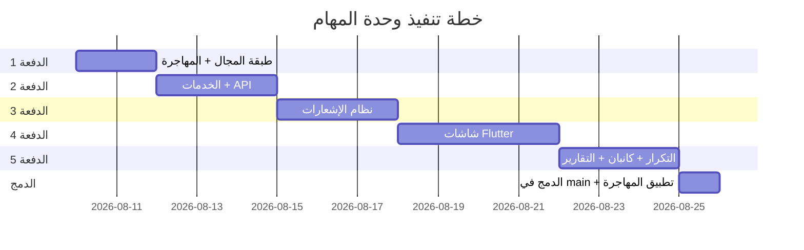

# خطة تنفيذ وحدة إدارة المهام + نظام الإشعارات — DMS

> **تاريخ الخطة:** 2026-08-09
> **الوحدة:** رقم 11 — إدارة المهام (Tasks) + نظام الإشعارات (Notifications)
> **المشروع:** DMS — نظام إدارة الوثائق الإلكتروني

---

## القرارات المعتمدة من المالك

| # | القرار | الإجابة |
|---|---|---|
| Q1 | الموظف يُنشئ مهام لنفسه | ✅ نعم |
| Q2 | المهام الفرعية | ❌ لاحقاً (الإصدار الثاني) |
| Q3 | المهام المتكررة | ✅ نعم من البداية |
| Q4 | لوحة كانبان | ✅ نعم من البداية |
| Q5 | إشعارات مع المهام | ✅ نعم |
| Q6 | الموظف يوزع على آخرين | ❌ لا — المدير فأعلى فقط |
| Q7 | ربط بأكثر من كتاب | ✅ وارد + صادر معاً |
| Q8 | إشعارات تصعيدية | ✅ نعم (موظف ← مدير ← رئيس) |
| Q9 | نوع الإشعارات | 📱 داخل التطبيق فقط حالياً |
| Q10 | مهمة قسم — المسؤول | 👥 كل الموظفين يرون ويحدّثون |
| Q11 | إعادة فتح مهمة مكتملة | ✅ نعم بسبب إلزامي (المدير فأعلى) |
| Q12 | تقارير أداء | ✅ PDF + Excel من البداية |

---

## نظرة عامة على الدفعات

| الدفعة | المحتوى | الملفات الجديدة | الملفات المعدَّلة |
|---|---|---|---|
| **1** | طبقة المجال + المهاجرة | ~6 | ~3 |
| **2** | الخدمات + الـ API | ~4 | ~4 |
| **3** | نظام الإشعارات | ~6 | ~6 |
| **4** | شاشات Flutter الأساسية | ~8 | ~8 |
| **5** | التكرار + كانبان + التقارير + لوحة التحكم | ~6 | ~4 |
| **المجموع** | | **~30** | **~25** |

---

## الدفعة 1: طبقة المجال (Domain Layer) + المهاجرة

### الهدف
بناء الكيانات والـ enums ومصفوفة الانتقالات والمهاجرة — كل ما يمسّ قاعدة البيانات.

---

### 1.1 الكيانات الجديدة

#### [NEW] `backend/Dms.Domain/Task.cs`

```csharp
public class DmsTask  // "DmsTask" لا "Task" لتفادي التعارض مع System.Threading.Tasks.Task
{
    // --- المعرّف والترقيم ---
    public int TaskId { get; set; }
    public int CompanyId { get; set; }
    public string? TaskNumber { get; set; }      // DEN-TSK-2026-00001
    public int? Year { get; set; }
    public int? SerialNo { get; set; }

    // --- المحتوى ---
    public string Title { get; set; } = "";       // max 500
    public string? Description { get; set; }      // نص حر (بلا HTML — ليست وثيقة)

    // --- التصنيف ---
    public TaskType TaskType { get; set; }        // Individual / Department
    public TaskPriority Priority { get; set; }    // Low / Normal / High / Urgent
    public TaskStatus Status { get; set; }        // New / InProgress / OnHold / Completed / Cancelled / Reopened

    // --- التقدم ---
    public int ProgressPercent { get; set; }      // 0-100

    // --- المواعيد ---
    public DateTime DueDate { get; set; }
    public DateTime? StartDate { get; set; }      // تاريخ بدء التنفيذ الفعلي
    public DateTime? CompletedDate { get; set; }

    // --- الإسناد ---
    public int? DepartmentId { get; set; }        // للمهام الجماعية
    public int? AssignedToUserId { get; set; }    // المسؤول المباشر (فردية)
    public int CreatedByUserId { get; set; }      // مُنشئ المهمة

    // --- الربط بالوثائق ---
    public int? RelatedIncomingId { get; set; }   // ربط اختياري بوارد
    public int? RelatedOutgoingId { get; set; }   // ربط اختياري بصادر

    // --- التكرار ---
    public bool IsRecurring { get; set; }
    public RecurrencePattern? RecurrencePattern { get; set; }  // Daily / Weekly / Monthly
    public int? RecurrenceInterval { get; set; }  // كل كم وحدة (كل 1 أسبوع، كل 2 شهر...)
    public DateTime? RecurrenceEndDate { get; set; }  // نهاية التكرار (null = بلا نهاية)
    public int? ParentRecurringTaskId { get; set; } // المهمة الأم المتكررة

    // --- ملاحظات ---
    public string? Notes { get; set; }

    // --- بنية تحتية ---
    public byte[] RowVersion { get; set; } = [];  // تزامن متفائل
    public bool IsDeleted { get; set; }
    public int? DeletedByUserId { get; set; }
    public DateTime? DeletedAt { get; set; }
    public DateTime CreatedAt { get; set; }
    public DateTime? UpdatedAt { get; set; }

    // --- تنقّل ---
    public Company Company { get; set; } = null!;
    public Department? Department { get; set; }
    public User? AssignedToUser { get; set; }
    public User CreatedByUser { get; set; } = null!;
    public IncomingBook? RelatedIncoming { get; set; }
    public OutgoingBook? RelatedOutgoing { get; set; }
    public DmsTask? ParentRecurringTask { get; set; }
    public ICollection<TaskUpdate> Updates { get; set; } = [];
    public ICollection<DmsTask> RecurringInstances { get; set; } = [];
}
```

#### [NEW] `backend/Dms.Domain/TaskUpdate.cs`

```csharp
public class TaskUpdate  // سجل شاهد — بلا حذف ناعم (نمط EmployeeLog)
{
    public int UpdateId { get; set; }
    public int TaskId { get; set; }
    public int CompanyId { get; set; }              // منسوخ للفلترة
    public TaskUpdateType UpdateType { get; set; }  // ProgressUpdate / StatusChange / Comment / Reassign / PriorityChange / DueDateChange / Reopen
    public string? OldValue { get; set; }
    public string? NewValue { get; set; }
    public string? Comment { get; set; }            // ملاحظة/تعليق مع التحديث
    public int UpdatedByUserId { get; set; }
    public DateTime UpdatedAt { get; set; }

    // --- تنقّل ---
    public DmsTask Task { get; set; } = null!;
    public User UpdatedByUser { get; set; } = null!;
}
```

> [!IMPORTANT]
> **`TaskUpdate` بلا حذف ناعم عمداً** — نفس نمط `EmployeeLog` (سجل شاهد يُكتب ولا يُعدَّل ولا يُحذف).

---

### 1.2 الـ Enums الجديدة

#### [MODIFY] `backend/Dms.Domain/Enums.cs`

```csharp
// ——— إضافات المهام ———

public enum TaskType
{
    Individual = 0,   // مهمة فردية لموظف محدد
    Department = 1,   // مهمة لقسم كامل
}

public enum TaskPriority
{
    Low = 0,
    Normal = 1,
    High = 2,
    Urgent = 3,
}

public enum TaskStatus
{
    New = 0,
    InProgress = 1,
    OnHold = 2,
    Completed = 3,
    Cancelled = 4,
    Reopened = 5,   // أُعيد فتحها بعد إكمالها
}

public enum TaskUpdateType
{
    ProgressUpdate = 0,
    StatusChange = 1,
    Comment = 2,
    Reassign = 3,
    PriorityChange = 4,
    DueDateChange = 5,
    Reopen = 6,
}

public enum RecurrencePattern
{
    Daily = 0,
    Weekly = 1,
    Monthly = 2,
}

// ——— تعديل AppModule ———
// إضافة:
Tasks = 512,

// تعديل Individual array:
// إضافة AppModule.Tasks

// تعديل OwnerType:
// إضافة Task = 4
```

> [!WARNING]
> **`AppModule.Tasks = 512`** — البت التالي بعد `Payroll = 256`. و**`All` تبقى 127** بلا Tasks عمداً (نفس نمط Employees/Payroll — يُمنح صراحةً). و`AllWithHr` تصبح `All | Employees | Payroll | Tasks = 1023`.

---

### 1.3 مصفوفة انتقالات المهمة

#### [NEW] `backend/Dms.Domain/TaskWorkflow.cs`

نمط `IncomingWorkflow.cs` بالضبط:

```csharp
public static class TaskWorkflow
{
    private static readonly Dictionary<TaskStatus, TaskStatus[]> Transitions = new()
    {
        [TaskStatus.New]        = [TaskStatus.InProgress, TaskStatus.Cancelled],
        [TaskStatus.InProgress] = [TaskStatus.OnHold, TaskStatus.Completed, TaskStatus.Cancelled],
        [TaskStatus.OnHold]     = [TaskStatus.InProgress, TaskStatus.Cancelled],
        [TaskStatus.Completed]  = [TaskStatus.Reopened],   // إعادة فتح (المدير فأعلى + سبب)
        [TaskStatus.Reopened]   = [TaskStatus.InProgress, TaskStatus.Cancelled],
        // Cancelled = نهائي
    };

    public static IReadOnlyList<TaskStatus> NextStatuses(TaskStatus from) => ...;
    public static bool CanTransition(TaskStatus from, TaskStatus to) => ...;
    public static void EnsureTransitionAllowed(TaskStatus from, TaskStatus to) => ...;
    public static bool IsActive(TaskStatus status) => status is New or InProgress or OnHold or Reopened;
    public static bool IsOverdue(DmsTask task) => IsActive(task.Status) && task.DueDate < DateTime.UtcNow;
    public static string ArabicName(TaskStatus status) => ...;
    public static string ArabicName(TaskPriority priority) => ...;
}
```

---

### 1.4 تعديلات على كيانات قائمة

#### [MODIFY] `backend/Dms.Domain/User.cs`
إضافة خاصية تنقّل:
```csharp
public ICollection<DmsTask> AssignedTasks { get; set; } = [];
public ICollection<DmsTask> CreatedTasks { get; set; } = [];
```

#### [MODIFY] `backend/Dms.Domain/User.cs` → `UserCompany`
إضافة علَم صلاحية:
```csharp
public bool CanManageTasks { get; set; }  // إنشاء/تعديل/إسناد مهام لآخرين
```

---

### 1.5 المهاجرة

#### [NEW] `backend/Dms.Infrastructure/Migrations/XXXXXXXX_AddTasksModule.cs`

**مهاجرة واحدة — إضافة بحتة** (لا إسقاط ولا نقل):

| الجدول | الأعمدة | الفهارس |
|---|---|---|
| `DmsTasks` | كل حقول `DmsTask` أعلاه | فريد: `(CompanyId, Year, SerialNo)` مفلتر · `TaskNumber` فريد · `IX_DepartmentId` · `IX_AssignedToUserId` · `IX_Status` · `IX_DueDate` |
| `TaskUpdates` | كل حقول `TaskUpdate` | `IX_TaskId` |
| `UserCompanies` | += `CanManageTasks bit NOT NULL DEFAULT 0` | — |

**العلاقات:**
- `DmsTask.CompanyId` → `Companies(CompanyId)` — Cascade
- `DmsTask.DepartmentId` → `Departments(DepartmentId)` — **SetNull**
- `DmsTask.AssignedToUserId` → `Users(UserId)` — **SetNull**
- `DmsTask.RelatedIncomingId` → `IncomingBooks(IncomingId)` — **SetNull**
- `DmsTask.RelatedOutgoingId` → `OutgoingBooks(OutgoingId)` — **SetNull**
- `DmsTask.ParentRecurringTaskId` → `DmsTasks(TaskId)` — **Restrict** (لا يُحذف الأم ما دام له أبناء)
- `TaskUpdate.TaskId` → `DmsTasks(TaskId)` — **Cascade**

#### [MODIFY] `backend/Dms.Infrastructure/Persistence/AppDbContext.cs`

- إضافة `DbSet<DmsTask> DmsTasks`
- إضافة `DbSet<TaskUpdate> TaskUpdates`
- فلتر عام: `!_filterByCompany || x.CompanyId == _companyId` + `!IsDeleted` (لـ DmsTask)
- فلتر عام: `!_filterByCompany || x.CompanyId == _companyId` (لـ TaskUpdate — بلا حذف ناعم)

### 1.6 التحقق — الدفعة 1

```bash
dotnet build Dms.sln              # 0 أخطاء / 0 تحذيرات
dotnet test                        # كل الاختبارات القائمة تمر
dotnet ef migrations add AddTasksModule -p Dms.Infrastructure -s Dms.Api
# تطبيق على قاعدة منفصلة (DmsTaskScratch) للتحقق
```

---

## الدفعة 2: الخدمات والـ API

### الهدف
بناء `TaskService` و`TasksController` مع كل نقاط الـ API.

---

### 2.1 الخدمة

#### [NEW] `backend/Dms.Infrastructure/Tasks/TaskService.cs`

```
المسؤوليات:
├── CreateAsync(dto)           — إنشاء مهمة + ترقيم تلقائي + سجل TaskUpdate
├── UpdateAsync(id, dto)       — تعديل (مع RowVersion) + سجل التغييرات
├── DeleteAsync(id)            — حذف ناعم
├── ChangeStatusAsync(id, ...)  — تغيير حالة عبر TaskWorkflow + سجل
├── UpdateProgressAsync(id, %) — تحديث النسبة + ملاحظة + سجل
├── ReassignAsync(id, userId)  — إعادة إسناد + سجل
├── ReopenAsync(id, reason)    — إعادة فتح (المدير فأعلى) + سبب إلزامي + سجل
├── AddCommentAsync(id, text)  — إضافة تعليق + سجل
├── GetByIdAsync(id)           — التفاصيل مع Updates
├── QueryAsync(filters)        — القائمة مع فلاتر + ترقيم صفحات
├── GetMyTasksAsync()          — مهام المستخدم الحالي
├── GetDepartmentTasksAsync(d) — مهام القسم
├── GetOverdueAsync()          — المتأخرة (محسوبة: DueDate < Now && IsActive)
├── GetSummaryAsync()          — ملخص للوحة التحكم
└── GetTaskUpdatesAsync(id)    — سجل التحديثات
```

**قواعد العمل:**
1. **الترقيم:** `{Prefix}-TSK-{Year}-{Serial:D5}` عبر `NumberingService` بنوع `"Task"` (نمط الصادر/الوارد)
2. **الإسناد:** الموظف يُنشئ لنفسه فقط (`AssignedToUserId = currentUser`) · المدير فأعلى يُسند لأي موظف في قسمه أو شركته
3. **مهمة القسم:** `TaskType = Department` + `DepartmentId` ≠ null · كل موظفي القسم يرونها ويحدّثونها
4. **إعادة الفتح:** `TaskStatus.Completed → Reopened` · المدير فأعلى فقط · سبب إلزامي (≥ 5 أحرف) · سجل في `TaskUpdate`
5. **النسبة:** 0-100 · عند الوصول إلى 100 **لا تتحول تلقائياً إلى مكتملة** — يجب تغيير الحالة صراحةً
6. **المتأخرة:** حالة **محسوبة** لا مخزّنة — `IsActive(status) && DueDate < DateTime.UtcNow`
7. **العزل:** فلتر `CompanyId` العام + قواعد الرؤية:
   - SuperAdmin/President: كل مهام الشركة
   - Manager: مهامه + مهام قسمه + المهام التي أنشأها
   - Employee: مهامه الشخصية + مهام قسمه
   - Reader: مهام قسمه (قراءة فقط)

#### [MODIFY] `backend/Dms.Infrastructure/DependencyInjection.cs`
تسجيل `TaskService`.

---

### 2.2 الـ Controller

#### [NEW] `backend/Dms.Api/Controllers/TasksController.cs`

```
[Route("api/tasks")]
[Authorize]
[RequireModule(AppModule.Tasks)]

GET    /                           — القائمة (فلاتر: status, priority, departmentId, assignedTo,
                                     createdBy, dueDateFrom, dueDateTo, isOverdue, search, page, pageSize)
GET    /{id}                       — التفاصيل مع Updates
POST   /                           — إنشاء مهمة
PUT    /{id}                       — تعديل (مع RowVersion)
DELETE /{id}                       — حذف ناعم
POST   /{id}/status                — تغيير الحالة {newStatus, reason?}
POST   /{id}/progress              — تحديث النسبة {percent, comment?}
POST   /{id}/reassign              — إعادة إسناد {assignedToUserId}
POST   /{id}/reopen                — إعادة فتح {reason}  — [RequireRole(Manager)]
POST   /{id}/comment               — إضافة تعليق {text}
GET    /{id}/updates               — سجل التحديثات
GET    /{id}/attachments           — مرفقات المهمة (OwnerType.Task)
POST   /{id}/attachments           — رفع مرفق
GET    /my                         — مهامي
GET    /department/{deptId}        — مهام القسم
GET    /overdue                    — المتأخرة
GET    /summary                    — ملخص للوحة التحكم
```

#### [MODIFY] `backend/Dms.Api/Middleware/RequireModuleAttribute.cs`
التأكد أنه يدعم `AppModule.Tasks` (يجب أن يعمل تلقائياً لأنه يقرأ bitmask).

#### [MODIFY] `backend/Dms.Infrastructure/Attachments/AttachmentService.cs`
إضافة `OwnerType.Task = 4` في التحقق.

### 2.3 العقود (DTOs)

```csharp
// في TasksController.cs أو ملف Contracts منفصل

record CreateTaskRequest(
    string Title,
    string? Description,
    string TaskType,          // "Individual" / "Department"
    string Priority,          // "Low" / "Normal" / "High" / "Urgent"
    DateTime DueDate,
    int? DepartmentId,
    int? AssignedToUserId,    // فقط للمدير فأعلى — الموظف يُسند لنفسه تلقائياً
    int? RelatedIncomingId,
    int? RelatedOutgoingId,
    bool IsRecurring,
    string? RecurrencePattern,
    int? RecurrenceInterval,
    DateTime? RecurrenceEndDate,
    string? Notes
);

record UpdateTaskRequest(/* نفس الحقول + string RowVersion */);

record TaskResponse(
    int TaskId, string TaskNumber, string Title, string? Description,
    string TaskType, string Priority, string Status,
    int ProgressPercent, DateTime DueDate, DateTime? StartDate, DateTime? CompletedDate,
    bool IsOverdue,  // محسوبة
    int? DepartmentId, string? DepartmentName,
    int? AssignedToUserId, string? AssignedToUserName,
    int CreatedByUserId, string CreatedByUserName,
    int? RelatedIncomingId, string? RelatedIncomingNumber,
    int? RelatedOutgoingId, string? RelatedOutgoingNumber,
    bool IsRecurring, string? RecurrencePattern, int? RecurrenceInterval,
    string? Notes, string RowVersion,
    DateTime CreatedAt, DateTime? UpdatedAt,
    List<TaskUpdateResponse>? Updates
);

record TaskUpdateResponse(
    int UpdateId, string UpdateType, string? OldValue, string? NewValue,
    string? Comment, int UpdatedByUserId, string UpdatedByUserName, DateTime UpdatedAt
);

record TaskSummaryResponse(
    int TotalActive, int TotalCompleted, int TotalOverdue,
    int MyActive, int MyOverdue, int DepartmentActive
);
```

### 2.4 التحقق — الدفعة 2

```bash
dotnet build Dms.sln              # 0/0
dotnet test                        # الاختبارات القائمة + اختبارات TaskWorkflow الجديدة
# تشغيل حيّ على DmsTaskScratch:
# POST /api/tasks → ترقيم صحيح
# PUT /api/tasks/{id}/status → الانتقالات المغلقة تعمل
# GET /api/tasks/overdue → المتأخرة تُحسب صحيحاً
```

---

## الدفعة 3: نظام الإشعارات (Notifications)

### الهدف
بناء نظام إشعارات عام يخدم المهام **وأي وحدة مستقبلية**.

> [!IMPORTANT]
> **نظام الإشعارات وحدة مستقلة** — يُبنى كنظام عام (ليس خاصاً بالمهام فقط) ليتمكن لاحقاً من إشعار الوارد والإحالات والإجازات... إلخ.

---

### 3.1 كيان الإشعار

#### [NEW] `backend/Dms.Domain/Notification.cs`

```csharp
public class Notification
{
    public long NotificationId { get; set; }      // long لأن الإشعارات كثيرة
    public int CompanyId { get; set; }
    public int RecipientUserId { get; set; }      // مَن يستلم الإشعار
    public string Title { get; set; } = "";       // عنوان مختصر
    public string Body { get; set; } = "";        // نص الإشعار
    public string Category { get; set; } = "";    // "Task" / "Incoming" / "Payroll" / "Leave" ...
    public string? EntityType { get; set; }       // "DmsTask" / "IncomingBook" ...
    public int? EntityId { get; set; }            // معرّف الكيان المرتبط
    public NotificationPriority Priority { get; set; }  // Normal / High
    public bool IsRead { get; set; }
    public DateTime? ReadAt { get; set; }
    public int? CreatedByUserId { get; set; }     // مَن تسبب بالإشعار (null = النظام)
    public DateTime CreatedAt { get; set; }
}

public enum NotificationPriority
{
    Normal = 0,
    High = 1,      // للتصعيد والتأخر
}
```

### 3.2 خدمة الإشعارات

#### [NEW] `backend/Dms.Infrastructure/Notifications/NotificationService.cs`

```
المسؤوليات:
├── SendAsync(recipientId, title, body, category, entityType?, entityId?, priority?)
├── SendToRoleInCompanyAsync(minRole, companyId, ...)  — إشعار لكل مَن دوره ≥ minRole
├── SendToDepartmentAsync(deptId, ...)                 — إشعار لموظفي القسم
├── GetUnreadCountAsync(userId)                        — عدد غير المقروءة (للشارة)
├── GetAsync(userId, page, pageSize, unreadOnly?)      — القائمة
├── MarkAsReadAsync(notificationId)                    — تحديد كمقروء
├── MarkAllAsReadAsync(userId)                         — تحديد الكل كمقروء
└── DeleteOldAsync(olderThan)                          — تنظيف الإشعارات القديمة (> 90 يوماً)
```

### 3.3 إشعارات المهام — الأحداث

| الحدث | مَن يستلم | الأولوية |
|---|---|---|
| **مهمة جديدة أُسندت لك** | المسؤول | Normal |
| **مهمة جديدة لقسمك** | كل موظفي القسم | Normal |
| **تحديث على مهمتك** (تعليق/نسبة) | مُنشئ المهمة + المسؤول | Normal |
| **مهمة أُعيد إسنادها لك** | المسؤول الجديد | Normal |
| **مهمة اكتملت** | مُنشئ المهمة | Normal |
| **مهمة أُعيد فتحها** | المسؤول | High |
| **⚠️ مهمة تقترب موعدها** (24 ساعة) | المسؤول | High |
| **🔴 مهمة متأخرة — المستوى 1** | المسؤول | High |
| **🔴 مهمة متأخرة — المستوى 2** (بعد 3 أيام) | المدير | High |
| **🔴 مهمة متأخرة — المستوى 3** (بعد 7 أيام) | الرئيس | High |

### 3.4 خدمة التصعيد

#### [NEW] `backend/Dms.Infrastructure/Tasks/TaskEscalationService.cs`

خدمة خلفية (`IHostedService`) تعمل **مرة كل ساعة** (نمط `BackupScheduler`):

```
كل ساعة:
├── جلب المهام النشطة التي DueDate < Now
├── لكل مهمة متأخرة:
│   ├── إذا تأخرت < 3 أيام  → إشعار للمسؤول (إن لم يُرسل اليوم)
│   ├── إذا تأخرت 3-7 أيام  → إشعار للمدير (إن لم يُرسل اليوم)
│   └── إذا تأخرت > 7 أيام  → إشعار للرئيس (إن لم يُرسل اليوم)
└── جلب المهام التي DueDate بين Now و Now+24h → إشعار تذكيري
```

> [!TIP]
> **الحماية من التكرار:** الخدمة تحفظ آخر إشعار لكل مهمة ولكل مستوى تصعيد، فلا تُرسل إشعاراً مكرراً في اليوم نفسه.

### 3.5 الـ API

#### [NEW] `backend/Dms.Api/Controllers/NotificationsController.cs`

```
[Route("api/notifications")]
[Authorize]

GET    /                    — قائمة الإشعارات (page, pageSize, unreadOnly?)
GET    /unread-count        — عدد غير المقروءة (للشارة في Topbar)
POST   /{id}/read           — تحديد كمقروء
POST   /read-all            — تحديد الكل كمقروء
```

### 3.6 المهاجرة

#### [NEW] `backend/Dms.Infrastructure/Migrations/XXXXXXXX_AddNotifications.cs`

| الجدول | الفهارس |
|---|---|
| `Notifications` | `IX_RecipientUserId_IsRead` · `IX_CompanyId` · `IX_CreatedAt` |

### 3.7 تعديلات الواجهة

#### [MODIFY] `app/lib/widgets/topbar.dart`
إضافة **أيقونة الجرس** 🔔 بشارة عدد الإشعارات غير المقروءة (نمط شارة الصادر/الوارد الموجودة).

#### [NEW] `app/lib/screens/notifications_screen.dart`
قائمة الإشعارات مع:
- فلتر: الكل / غير المقروءة
- كل إشعار قابل للنقر → يفتح الكيان المرتبط (مهمة / وارد / ...)
- تمرير لليسار = تحديد كمقروء
- زرّ "تحديد الكل كمقروء"

#### [NEW] `app/lib/core/notification_providers.dart`
`unreadCountProvider` + `notificationsProvider` + `markAsReadProvider`

### 3.8 التحقق — الدفعة 3

```bash
dotnet build && dotnet test
# تشغيل حيّ:
# إنشاء مهمة → إشعار يظهر للمسؤول
# GET /api/notifications/unread-count → العدد صحيح
# POST /api/notifications/{id}/read → يتناقص العدد
# التصعيد: تعديل DueDate لمهمة لتصبح متأخرة → انتظار ساعة → إشعار للمسؤول
```

---

## الدفعة 4: شاشات Flutter الأساسية

### الهدف
بناء واجهة المهام كاملة مع التوصيل بالـ API.

---

### 4.1 الملفات الجديدة

| # | الملف | الوصف |
|---|---|---|
| 1 | `app/lib/models_tasks.dart` | نماذج البيانات: `TaskModel`, `TaskUpdateModel`, `TaskSummaryModel` |
| 2 | `app/lib/core/task_providers.dart` | مزوّدات Riverpod: القائمة, التفاصيل, الفلاتر, الإحصائيات |
| 3 | `app/lib/screens/task_list_screen.dart` | **قائمة المهام** — جدول بفلاتر + بحث + شارات ملونة |
| 4 | `app/lib/screens/task_form_screen.dart` | **إنشاء/تعديل مهمة** — النموذج الكامل |
| 5 | `app/lib/screens/task_detail_screen.dart` | **تفاصيل المهمة** — عرض + timeline + مرفقات + تحديث سريع |
| 6 | `app/lib/screens/task_kanban_screen.dart` | **لوحة كانبان** — أعمدة بصرية مع سحب وإفلات |
| 7 | `app/lib/widgets/task_status_pill.dart` | شارة حالة المهمة (ملونة حسب الحالة + متأخرة) |
| 8 | `app/lib/widgets/task_priority_badge.dart` | شارة الأولوية (أحمر/برتقالي/أزرق/رمادي) |

### 4.2 تفاصيل كل شاشة

#### شاشة 1: قائمة المهام (`task_list_screen.dart`)

```
┌─────────────────────────────────────────────────────┐
│ 📋 المهام                    [+ مهمة جديدة] [كانبان] │
├─────────────────────────────────────────────────────┤
│ [بحث...]  [الحالة ▼] [الأولوية ▼] [القسم ▼] [مهامي]│
├─────┬──────────┬────────┬─────────┬────────┬────────┤
│  #  │ العنوان  │المسؤول │ الموعد  │الأولوية│ الحالة │
├─────┼──────────┼────────┼─────────┼────────┼────────┤
│ 001 │ مراجعة.. │ أحمد   │ 15 آب   │ 🔴عاجل │ ⏳ قيد  │
│ 002 │ إعداد..  │ سارة   │ 20 آب   │ 🟡عالي │ 🆕 جديد│
│ 003 │ ...      │ القسم  │ 10 آب   │ 🔵عادي │ 🔴متأخر│
└─────┴──────────┴────────┴─────────┴────────┴────────┘
                                      [📄 1 من 5 →]
```

- **الفلاتر:** الحالة (شريط أزرار مقطّعة) · الأولوية · القسم · المسؤول · مهامي فقط · متأخرة فقط
- **الشارات الملونة:** حسب الحالة والأولوية (نمط `status_pill.dart` الموجود)
- **المهام المتأخرة:** صفّ بخلفية حمراء خفيفة + أيقونة ⚠️

#### شاشة 2: إنشاء/تعديل مهمة (`task_form_screen.dart`)

```
┌──────────────────────────────────────┐
│        إنشاء مهمة جديدة             │
├──────────────────────────────────────┤
│ النوع: (◉ فردية) (○ لقسم)           │
│                                      │
│ العنوان: [_________________________] │
│ الوصف:  [_________________________] │
│         [_________________________] │
│                                      │
│ المسؤول: [أحمد محمد ▼]  ← للمدير+   │
│ القسم:   [المالية ▼]    ← لمهمة قسم │
│                                      │
│ الموعد النهائي: [📅 2026-08-20]      │
│ الأولوية:  (○ عادي) (◉ عالي) (○ عاجل)│
│                                      │
│ ── ربط اختياري ──                    │
│ كتاب وارد: [DEN-IN-2026-00015 ▼]    │
│ كتاب صادر: [DEN-2026-00124 ▼]       │
│                                      │
│ ── تكرار ──                          │
│ [✓] مهمة متكررة                      │
│ كل: [1] [شهر ▼]                     │
│ حتى: [📅 2026-12-31] أو [بلا نهاية] │
│                                      │
│ ملاحظات: [_________________________] │
│                                      │
│        [💾 حفظ]    [❌ إلغاء]         │
└──────────────────────────────────────┘
```

**قواعد النموذج:**
- `TaskType = Individual` + دور الموظف → `AssignedToUserId = currentUser` (مخفي)
- `TaskType = Individual` + دور المدير+ → يختار المسؤول من قائمة
- `TaskType = Department` → يختار القسم (المسؤول اختياري)
- `DueDate` إلزامي ولا يقبل تاريخاً في الماضي
- الربط بالوارد/الصادر: بحث بالرقم أو قائمة منسدلة

#### شاشة 3: تفاصيل المهمة (`task_detail_screen.dart`)

```
┌──────────────────────────────────────┐
│ TSK-2026-00001                [✏️][🗑]│
├──────────────────────────────────────┤
│ 📋 مراجعة العقد السنوي               │
│ 🔴 عاجل  ·  ⏳ قيد التنفيذ           │
│                                      │
│ ████████████░░░░░░░░  60%            │
│ ← شريط تقدم بصري متحرك              │
│                                      │
│ المسؤول: أحمد محمد                    │
│ المُنشئ: المدير العام                 │
│ الموعد: 15 آب 2026 (باقي 6 أيام)     │
│ القسم: المالية                        │
│ 🔗 وارد: DEN-IN-2026-00015           │
│ 🔗 صادر: DEN-2026-00124              │
│                                      │
│ ── الوصف ──                          │
│ مراجعة بنود العقد السنوي مع الشركة..  │
│                                      │
│ ── المرفقات (2) ──                   │
│ 📎 عقد_2026.pdf  📎 ملحق_مالي.xlsx    │
│ [+ رفع مرفق]                         │
│                                      │
│ ── سجل التحديثات ──                  │
│ 🕐 09 آب 14:30 — أحمد: نسبة 40%→60% │
│    "أنهيت مراجعة البنود 1-15"        │
│ 🕐 08 آب 10:00 — أحمد: بدء التنفيذ   │
│ 🕐 07 آب 09:00 — المدير: إنشاء مهمة  │
│                                      │
│ ── تحديث سريع ──                     │
│ النسبة: [====60====] [🔄]            │
│ ملاحظة: [_________________________]  │
│ [📎 مرفق]  [💾 تحديث]                │
│                                      │
│ [▶️ بدء] [⏸ تعليق] [✅ إكمال] [❌ إلغاء]│
└──────────────────────────────────────┘
```

#### شاشة 4: لوحة كانبان (`task_kanban_screen.dart`)

```
┌─────────┬─────────┬─────────┬─────────┬─────────┐
│ 🆕 جديد │ ▶️ تنفيذ│ ⏸ معلّق │ 🔄 معاد │ ✅ مكتمل│
│   (3)   │   (5)   │   (1)   │   (0)   │  (12)   │
├─────────┼─────────┼─────────┼─────────┼─────────┤
│┌───────┐│┌───────┐│┌───────┐│         │┌───────┐│
││مراجعة ││├───────┤││إعداد  ││         ││تقرير  ││
││العقد  ││├🔴عاجل┤││التقرير││         ││الشهري ││
││───────││├أحمد──┤││───────││         ││───────││
││🔴عاجل ││├15 آب─┤││🟡عالي ││         ││✅     ││
││أحمد   ││└───────┘││سارة   ││         │└───────┘│
││15 آب  ││         │└───────┘│         │         │
│└───────┘│         │         │         │         │
│┌───────┐│         │         │         │         │
││...    ││         │         │         │         │
│└───────┘│         │         │         │         │
└─────────┴─────────┴─────────┴─────────┴─────────┘
```

- **سحب وإفلات:** سحب بطاقة بين الأعمدة = تغيير حالة (عبر `TaskWorkflow`)
- **بطاقة المهمة:** العنوان + الأولوية (لون) + المسؤول + الموعد + متأخرة (🔴)

### 4.3 التعديلات على ملفات قائمة

| الملف | التعديل |
|---|---|
| `app/lib/widgets/sidebar.dart` | إضافة قسم "المهام" 📋 مع شارة عدد المهام النشطة |
| `app/lib/screens/home_shell.dart` | إضافة `TaskListScreen` و`TaskKanbanScreen` في مصفوفة الصفحات |
| `app/lib/core/session.dart` | إضافة `hasTasksModule` + `canManageTasks` |
| `app/lib/core/api_client.dart` | إضافة methods: `getTasks`, `createTask`, `updateTask`, `deleteTask`, `changeTaskStatus`, `updateProgress`, `reassignTask`, `reopenTask`, `addComment`, `getTaskUpdates`, `getTaskSummary`, `getMyTasks`, `getOverdueTasks` |
| `app/lib/core/nav_intent.dart` | إضافة `TaskIntent` (للتنقل من لوحة التحكم إلى المهام بفلتر) |
| `app/lib/models.dart` أو ملف منفصل | إضافة `TaskModel`, `TaskUpdateModel`, `TaskSummaryModel` |
| `app/lib/screens/incoming_detail_screen.dart` | إضافة زرّ "إنشاء مهمة من هذا الكتاب" |
| `app/lib/screens/outgoing_detail_screen.dart` | إضافة زرّ "إنشاء مهمة من هذا الكتاب" |

### 4.4 التحقق — الدفعة 4

```bash
cd app && flutter analyze          # No issues found
flutter test                        # الاختبارات القائمة + الجديدة
flutter run -d chrome              # تنقر يدوي على كل الشاشات
```

**اختبارات واجهة جديدة:**
- حارس صلاحيات: قسم المهام يظهر/يختفي حسب `AppModule.Tasks`
- حارس الإسناد: الموظف لا يرى قائمة اختيار المسؤول
- حارس إعادة الفتح: الموظف لا يرى زرّ إعادة الفتح

---

## الدفعة 5: التكرار + التقارير + لوحة التحكم

### الهدف
إكمال المهام المتكررة، تقارير الأداء، وتحديث لوحة التحكم.

---

### 5.1 المهام المتكررة

#### [MODIFY] `backend/Dms.Infrastructure/Tasks/TaskRecurrenceService.cs`

خدمة خلفية (`IHostedService`) تعمل **مرة كل ساعة** (يمكن دمجها مع `TaskEscalationService`):

```
كل ساعة:
├── جلب المهام المتكررة التي أُكملت أو أُلغيت
├── لكل مهمة:
│   ├── حساب تاريخ الاستحقاق التالي حسب النمط (يومي/أسبوعي/شهري)
│   ├── إذا RecurrenceEndDate != null && nextDue > endDate → توقف
│   ├── إنشاء مهمة جديدة بنفس المحتوى + DueDate الجديد
│   ├── ربط ParentRecurringTaskId بالمهمة الأم
│   └── إرسال إشعار للمسؤول
```

### 5.2 تقارير أداء المهام

#### [NEW] `backend/Dms.Documents/Reports/TaskReportPdf.cs`

تقرير PDF عربي RTL (نمط `PayrollSheetPdf.cs`):
- عنوان: "تقرير أداء المهام — {الشهر/الفترة}"
- جدول لكل موظف/قسم:
  - المهام المكتملة | المتأخرة | قيد التنفيذ | الملغاة
  - متوسط وقت الإنجاز (بالأيام)
  - نسبة الإنجاز في الوقت

#### [NEW] `backend/Dms.Documents/Reports/TaskReportExcel.cs`

تقرير Excel منسّق (نمط `ExcelExporter.cs`):
- ورقة 1: ملخص عام
- ورقة 2: تفصيل كل مهمة
- ألوان: أخضر (مكتمل في الوقت) · أحمر (متأخر) · أصفر (قيد التنفيذ)

#### إضافة نقاط API

```
GET  /api/tasks/report/pdf?from=...&to=...&departmentId=...  — تقرير PDF
GET  /api/tasks/report/excel?from=...&to=...&departmentId=... — تقرير Excel
```

### 5.3 تحديث لوحة التحكم

#### [MODIFY] `app/lib/screens/dashboard_screen.dart`

إضافة **3 بطاقات** جديدة (نمط بطاقات HR الموجودة):

| البطاقة | المحتوى | النقر → |
|---|---|---|
| 📋 **مهام نشطة** | عدد مهامي النشطة | قائمة المهام (فلتر: مهامي) |
| 🔴 **مهام متأخرة** | عدد المهام المتأخرة (بلون أحمر) | قائمة المهام (فلتر: متأخرة) |
| ✅ **مهام مكتملة هذا الشهر** | العدد + نسبة من الإجمالي | قائمة المهام (فلتر: مكتملة) |

#### [NEW] `app/lib/screens/task_report_screen.dart`

شاشة تقارير المهام:
- فلاتر: الفترة (من/إلى) · القسم · الموظف
- عرض: جدول ملخّص + رسم بياني (fl_chart)
- أزرار: تصدير PDF · تصدير Excel

### 5.4 التحقق — الدفعة 5

```bash
dotnet build && dotnet test && flutter analyze && flutter test
# التكرار: إنشاء مهمة متكررة → إكمالها → التحقق من إنشاء النسخة التالية
# التقارير: تصدير PDF و Excel → فتحهما → التأكد من صحة الأرقام
# لوحة التحكم: التحقق من البطاقات + النقر → الفلتر الصحيح
```

---

## خطة التحقق الشاملة

### اختبارات الوحدة (الهدف: ~35 اختبار)

| مجموعة | التحقق | العدد |
|---|---|---|
| `TaskWorkflowTests` | مصفوفة الانتقالات · الانتقالات المرفوضة · إعادة الفتح | ~8 |
| `TaskServiceTests` | الإنشاء · التعديل · الحذف · الترقيم · الصلاحيات · RowVersion | ~12 |
| `TaskRecurrenceTests` | الحساب الدوري · يومي/أسبوعي/شهري · نهاية التكرار | ~6 |
| `NotificationServiceTests` | الإرسال · التصعيد · عدم التكرار | ~5 |
| `TaskReportTests` | صحة PDF/Excel · الفلاتر | ~4 |

### اختبارات الواجهة (الهدف: ~20 اختبار)

| مجموعة | التحقق |
|---|---|
| حرّاس الصلاحيات | قسم المهام يظهر/يختفي · زرّ إعادة الفتح · اختيار المسؤول |
| حرّاس الرسم | فيض التخطيط في كل الشاشات بعروض مختلفة |
| حرّاس التنقل | النقر من لوحة التحكم → الفلتر الصحيح |
| حرّاس النماذج | صحة النموذج + الإشعارات |

### E2E (الهدف: ~50 تحقق)

#### [NEW] `backend/e2e/tasks-e2e.ps1`

```
├── إنشاء مهمة فردية + ترقيم → 200
├── إنشاء مهمة لقسم → 200
├── تغيير حالة: New → InProgress → Completed → 200
├── انتقال مرفوض: New → Completed → 400
├── تحديث نسبة: 0 → 50 → 100 → 200
├── تعليق + سجل → 200
├── إعادة إسناد → 200
├── إعادة فتح (مدير + سبب) → 200
├── إعادة فتح (موظف) → 403
├── إعادة فتح (بلا سبب) → 400
├── ربط بوارد + صادر → 200
├── المرفقات: رفع + قائمة + تنزيل → 200
├── RowVersion → 409
├── 🔐 موظف يُنشئ مهمة لآخر → 403
├── 🔐 موظف يُنشئ لنفسه → 200
├── 🔐 مدير يُنشئ لموظف قسمه → 200
├── 🔐 قارئ يُنشئ مهمة → 403
├── المتأخرة: DueDate في الماضي + GetOverdue → تظهر
├── الإشعارات: إنشاء مهمة → إشعار للمسؤول → 200
├── الإشعارات: unread-count → العدد صحيح
├── الإشعارات: mark-as-read → يتناقص
├── مهمة متكررة: إنشاء + إكمال → إنشاء تلقائي للتالية
├── التقارير: PDF + Excel → 200 + حجم > 0
├── الحذف الناعم → 200
└── عزل الشركة: مهمة شركة 1 لا تظهر في شركة 2
```

---

## قائمة الملفات النهائية

### ملفات جديدة (~30)

| # | المسار | الدفعة |
|---|---|---|
| 1 | `backend/Dms.Domain/Task.cs` | 1 |
| 2 | `backend/Dms.Domain/TaskUpdate.cs` | 1 |
| 3 | `backend/Dms.Domain/TaskWorkflow.cs` | 1 |
| 4 | `backend/Dms.Domain/Notification.cs` | 3 |
| 5 | `backend/Dms.Infrastructure/Migrations/AddTasksModule.cs` | 1 |
| 6 | `backend/Dms.Infrastructure/Migrations/AddNotifications.cs` | 3 |
| 7 | `backend/Dms.Infrastructure/Tasks/TaskService.cs` | 2 |
| 8 | `backend/Dms.Infrastructure/Tasks/TaskEscalationService.cs` | 3 |
| 9 | `backend/Dms.Infrastructure/Tasks/TaskRecurrenceService.cs` | 5 |
| 10 | `backend/Dms.Infrastructure/Notifications/NotificationService.cs` | 3 |
| 11 | `backend/Dms.Api/Controllers/TasksController.cs` | 2 |
| 12 | `backend/Dms.Api/Controllers/NotificationsController.cs` | 3 |
| 13 | `backend/Dms.Documents/Reports/TaskReportPdf.cs` | 5 |
| 14 | `backend/Dms.Documents/Reports/TaskReportExcel.cs` | 5 |
| 15 | `backend/Dms.Tests/TaskWorkflowTests.cs` | 2 |
| 16 | `backend/Dms.Tests/TaskServiceTests.cs` | 2 |
| 17 | `backend/Dms.Tests/TaskRecurrenceTests.cs` | 5 |
| 18 | `backend/Dms.Tests/NotificationServiceTests.cs` | 3 |
| 19 | `backend/e2e/tasks-e2e.ps1` | 2+ |
| 20 | `app/lib/models_tasks.dart` | 4 |
| 21 | `app/lib/core/task_providers.dart` | 4 |
| 22 | `app/lib/core/notification_providers.dart` | 3 |
| 23 | `app/lib/screens/task_list_screen.dart` | 4 |
| 24 | `app/lib/screens/task_form_screen.dart` | 4 |
| 25 | `app/lib/screens/task_detail_screen.dart` | 4 |
| 26 | `app/lib/screens/task_kanban_screen.dart` | 4 |
| 27 | `app/lib/screens/task_report_screen.dart` | 5 |
| 28 | `app/lib/screens/notifications_screen.dart` | 3 |
| 29 | `app/lib/widgets/task_status_pill.dart` | 4 |
| 30 | `app/lib/widgets/task_priority_badge.dart` | 4 |

### ملفات معدَّلة (~25)

| # | المسار | التعديل | الدفعة |
|---|---|---|---|
| 1 | `backend/Dms.Domain/Enums.cs` | + TaskType/Priority/Status/UpdateType/RecurrencePattern enums + AppModule.Tasks + OwnerType.Task | 1 |
| 2 | `backend/Dms.Domain/User.cs` | + تنقّل AssignedTasks/CreatedTasks + CanManageTasks في UserCompany | 1 |
| 3 | `backend/Dms.Infrastructure/Persistence/AppDbContext.cs` | + DbSet<DmsTask> + DbSet<TaskUpdate> + DbSet<Notification> + فلاتر عامة | 1,3 |
| 4 | `backend/Dms.Infrastructure/DependencyInjection.cs` | + TaskService + NotificationService + TaskEscalationService + TaskRecurrenceService | 2,3,5 |
| 5 | `backend/Dms.Infrastructure/Attachments/AttachmentService.cs` | + OwnerType.Task validation | 2 |
| 6 | `backend/Dms.Api/Services/NumberingService.cs` | + Counter type "Task" | 2 |
| 7 | `app/lib/widgets/sidebar.dart` | + قسم المهام + شارة | 4 |
| 8 | `app/lib/widgets/topbar.dart` | + أيقونة الإشعارات 🔔 + شارة | 3 |
| 9 | `app/lib/screens/home_shell.dart` | + TaskListScreen في مصفوفة الصفحات | 4 |
| 10 | `app/lib/core/session.dart` | + hasTasksModule + canManageTasks | 4 |
| 11 | `app/lib/core/api_client.dart` | + كل methods المهام والإشعارات | 4 |
| 12 | `app/lib/core/nav_intent.dart` | + TaskIntent | 4 |
| 13 | `app/lib/screens/dashboard_screen.dart` | + 3 بطاقات مهام | 5 |
| 14 | `app/lib/screens/incoming_detail_screen.dart` | + زرّ "إنشاء مهمة" | 4 |
| 15 | `app/lib/screens/outgoing_detail_screen.dart` | + زرّ "إنشاء مهمة" | 4 |
| 16 | `app/lib/screens/users_screen.dart` | + مربّع Tasks + علَم CanManageTasks | 4 |

---

## القرارات التقنية (ADR المتوقعة)

| ADR | العنوان | القرار |
|---|---|---|
| **ADR-029** | وحدة المهام — التصميم العام | `DmsTask` + `TaskUpdate` + `TaskWorkflow` + ربط ثنائي مع الوارد/الصادر |
| **ADR-030** | نظام الإشعارات العام | كيان `Notification` عام + تصعيد تلقائي + داخل التطبيق فقط |
| **ADR-031** | المهام المتكررة | خدمة خلفية تُنشئ المهمة التالية عند إكمال الحالية |

---

## ترتيب التنفيذ والدمج



---

## قاعدة الدمج والنشر (نمط الوحدات السابقة)

1. **فرع عمل منفصل** — لا يُدمج في `main` حتى يكتمل ويُختبر
2. **قاعدة منفصلة** (`DmsTaskScratch`) للتجريب
3. **نسخة احتياطية** قبل الدمج
4. **الدمج ← ثم تطبيق المهاجرة** على `DmsDb` (القاعدة مورد مشترك)
5. **تحقّق حيّ** بعد التطبيق (البيانات القائمة سليمة + الوحدات القائمة تعمل)

> [!CAUTION]
> **لا تُطبَّق المهاجرة على `DmsDb` قبل دمج كودها في `main`** — القاعدة المكتوبة في `rules/workflow.md` والمُثبتة في كل الوحدات السابقة.
